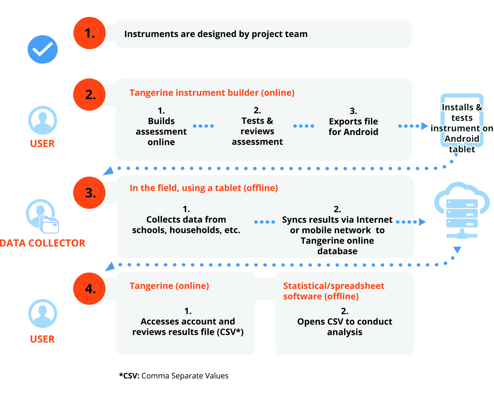

# About Tangerine

Tangerine is electronic data collection software designed for use on Android mobile devices. Its primary use is to enable offline data capture in low-resource areas. 

Tangerine was first developed to capture student responses in in oral early grade reading and mathematics skills assessments, specifically Early Grade Reading Assessment (EGRA) and Early Grade Mathematics Assessment (EGMA). As well as capture interview responses from students, teachers and principals on home and school context information. Tangerine's capabilities have been expanded for data capture and management for rural health intervention projects. 

Using Tangerine improves data quality and the efficiency of data collection and analysis by simplifying the preparation and implementation of field work, reducing measurement and data entry errors, and eliminating manual data entry from paper forms. 

Tangerine was developed in 2011 by RTI International with its own internal research funds, and made available to the public through a GNU General Public License. RTI redesigned Tangerine and developed a new codebase using latest technologies in 2018 with funding support from Google.org. As an open source software platform Tangerine's source code is available for anyone who wishes to install and use Tangerine on their own web server. Tangerine's source code and related documentation is available on Github, a commonly used repository for open source software.  To learn more and have a look under the hood, check out Tangerine's Code Repositories on Github.

## How it works

