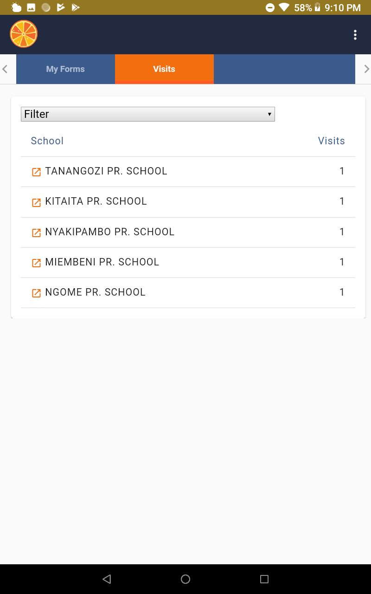

Data collection on Device
--------------------------

Select the instrument to use, and follow the prompts, sections, and
items on the screen, as generated in the instrument/form editor. To
select an answer option, just tab on it.

!!! warning 
    Different to all other inputs, where the user/assessor selects the applicable / correct response which will then be marked in blue, in grids, the user has to select all **INCORRECT** items (they will turn blue).

Answer the rest of the questions as they are presented to you.

Resuming Instrument
-------------------

Should an administration be interrupted, or to be completed at a later
stage, navigate to "**Visits**" on the top of the tablet screen.

!!! warning 
    You have to have a location section and location list loaded for your instrument to be able to access the resume feature in Tangerine. Make up a location list, even if it only has one column header entry and one item underneath (e.g. column A header is "site", row 2 entry is "test site". Without a location list loaded, you will not have a "Visits" tab on the tablet from which to resume the instrument.

Select the appropriate location and date (as applicable) from the menu. Tangerine will automatically return the user to the last, incomplete section/page of the instrument.

You can return from the "Visits" page to the main screen by hitting the
Tangerine icon.

