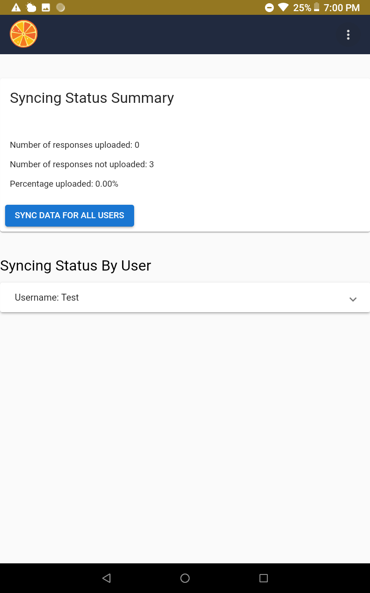

Data Synchronization
----------------------------------------------------------------------------------------------

Whenever possible during data collection, recommend that users /
assessors to sync their data to the tablet by navigating to the profile
menu, and select "**Sync**".

The Sync screen provides an overview of the data upload/sync status to
date, including the number of responses not yet uploaded as shown below.

Once the sync is complete, Tangerine will show "**100%**" for the field
"**Percentage uploaded**".

