Deploying Tangerine for Offline (or Online) Data Collection 
===========================================================

Once the user is done creating the instruments/forms the next step is to
deploy the instrument to an Android device for data collection. To
release your instruments or instrument updates, select the "Release" tab
in the top menu of the main group page.

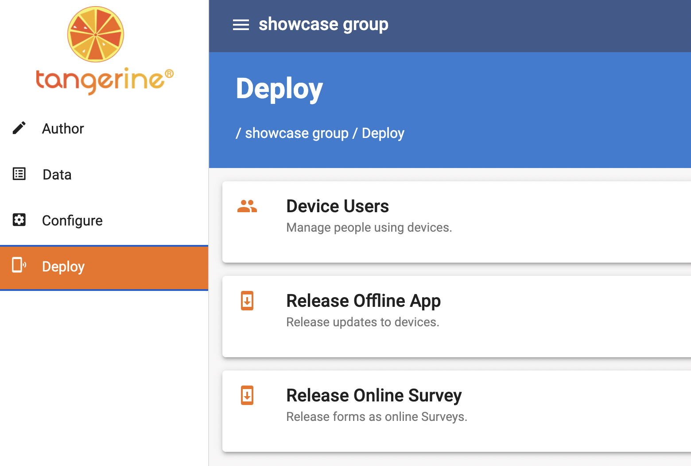

Upon selecting "Release", you will see the screen below.

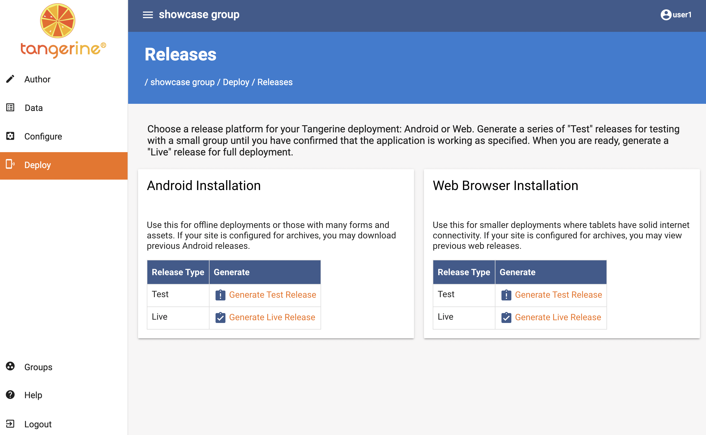

Tangerine offers two deployment types, test release and live release:

1.  **Test Release** -- This release option ("release to QA") is
    recommended for testing the instruments. When you make changes and
    updates to the instruments and release your changes as "Test
    Release", tablets that have the "real" version of Tangerine
    installed will NOT receive this update. HOWEVER, any data synced
    from the tablet devices even in a "Test Release" deployment goes
    into the main database (thus mark your tests clearly as "TESTS" to
    facilitate data cleaning.

2.  **Live Release** -- When instruments/forms are final, or instrument
    edits have been tested, use this release option ("release to
    production"). In this case, tablets that are already collecting
    data, or have the group's apk installed, will received an update
    request when connecting to the Internet the next time. All data
    collected from this release will also be added to the main database.

Tangerine also offers two deployment /installation strategies, Android
installation or web browser installation:

-   **Android Installation**. This is the standard deployment package
    where an actual apk file can be generated on the computer,
    downloaded, and then copied over to a mobile device via a USB cable
    and installed. This method of deployment is suitable in slow network
    environment or when the apk is large.

-   **Web Browser Installation**. This deployment strategy requires an
    Internet connection on the tablet for the Tangerine to be installed.
    Once installed, the app can work again offline. This method is
    suitable in places of good connectivity.

**NOTE**: We recommend thoroughly testing your instruments and its data
output before releasing them! To test your instrument use the Test Release mode.

# Using standard installation 

Android Installation
--------------------

This deployment strategy creates an APK file which can be installed on
an Android tablet or smartphone. Click on Android Installation Test
Release/Live Release as shown in the screen above. **Wait.**

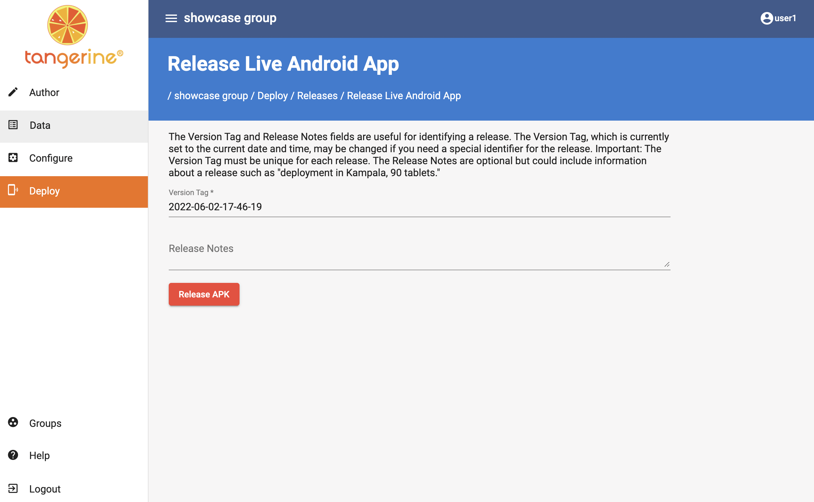

Once Tangerine has compiled the apk, click on "Download your APK here",
as shown below. This will download an apk file into your computer's
downloads folder.

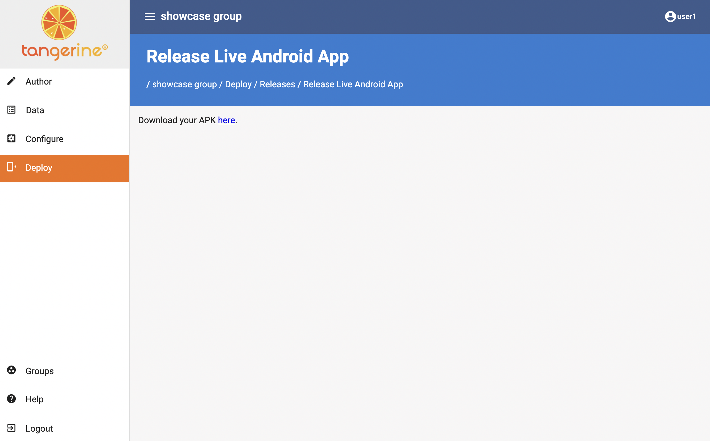

!!! Warning 
     Every time an instrument/form is changed, added, or deleted from the group, it is necessary to create a release and alert each tablet user to use the "Check for Update" option in order to update their application.

Web Browser Installation
------------------------

This deployment strategy creates a link/URL to a "progressive web app"
(PWA) for direct installation from the web to the Android tablet or
smartphone. Click on Web Browser Installation Test Release/Live Release.
**Wait.**

Once Tangerine has compiled the PWA, it will show an installation URL
like in the screen below.

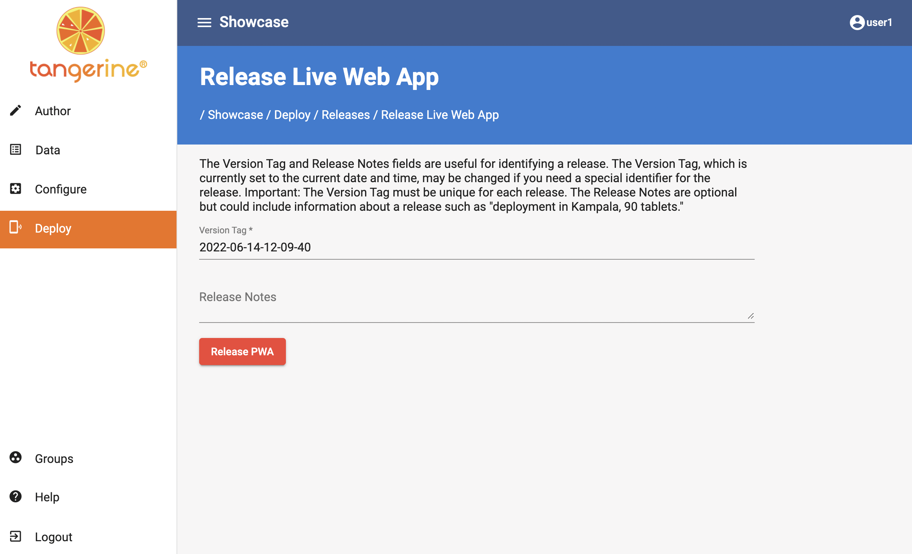

Use this URL from the **Chrome browser on the tablet** to install the
PWA on the tablet devices.

You can also copy the URL and open a new browser tab with this URL on
your computer to test your instruments online. The browser window may
require you to confirm that you want to apply the updates.

After "**Click here to proceed**", Tangerine will show an online data
collection version of your instruments with a similar look and function
as on a tablet/smartphone.

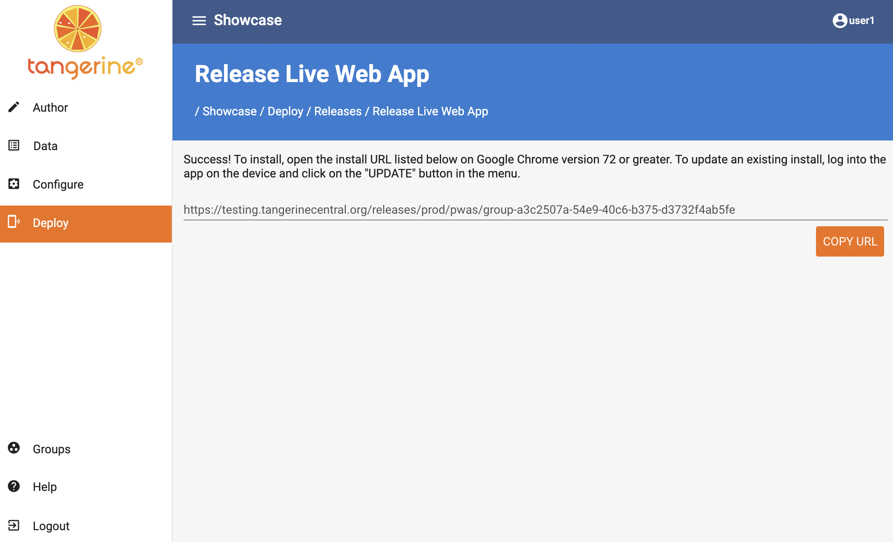

!!! Warning 
     Every time an instrument/form is changed, added, or deleted from the group, it is necessary to release the apk/pwa again, but **NO NEW INSTALLATION is necessary** on the tablets. Instead, instruct Tangerine tablet users to connect their tablets, select their profile page (3 vertical white dots on top right of tablet screen).

Select "**Check for Update**" and proceed to install the update.

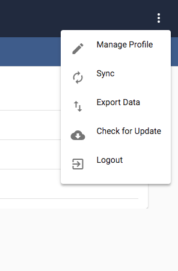

!!! Warning 
    This update approach will not only apply any instrument/form edits, new forms, or form deletions, but also any **updates to the Tangerine application** made in the meantime and applied to your group (if any).

# Using Device Setup Installation

Installation 
============

Tangerine offers two deployment /installation strategies, Android
installation or web browser installation:

-   Android Installation. This is the standard deployment package where
    an actual apk file can be generated on the computer, downloaded, and
    then copied over to a mobile device via a USB cable and installed.
    This method of deployment is suitable in slow network environment or
    when the apk is large.

-   Web Browser Installation. This deployment strategy requires an
    Internet connection on the tablet for the Tangerine to be installed.
    Once installed, the app can work again offline. This method is
    suitable in places of good connectivity. This method of installation
    can also be used for installing app on your Chrome browser on a PC
    or laptop

For both of the installation models you will need a Registration Code
(QR Code) or a device ID and Token. If you don't have this information
you will not be able to install the application on your device.

We recommend that the initial device setup is done by a responsible
person at the site. This can be someone who will handle queries
regarding Tangerine or an IT staff. Each device registration requires
that an admin user is create on that device. This admin user is the one
that can authorize the registration of a user account. This is to make
sure that your data can only be accessed by authorized personnel and no
untheorized accounts exist on the tablet.

Installation on a tablet/phone
------------------------------

Copy the apk file to the tablet and open it. Follow the installation
prompts until you receive a message that the app has been installed.
Locate the Tangerine app in the application drawer and click it.

!!! Warning
    Note that you must be online on the tablet to do the initial installation.

The first step is to select the language for the user interface

Select the language and click Submit

Now enter the administration password for this tablet. You may wish to
use the same admin password for all tables at your site. This same
password will be required each time a user is registering to use the app
on this device.

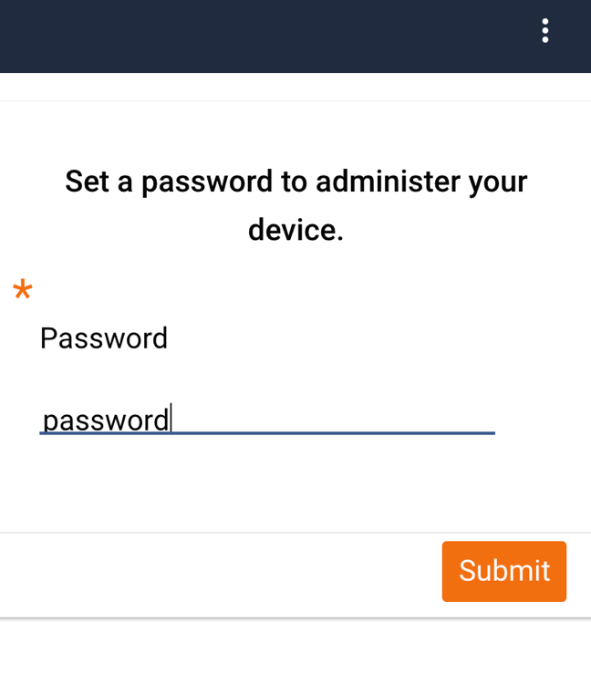

Select Yes if you have a device code or No if you are going to insert a
device ID and Token for the registration.

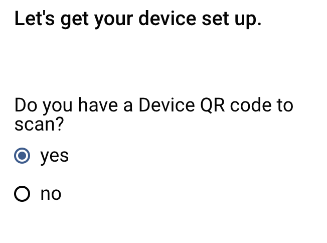

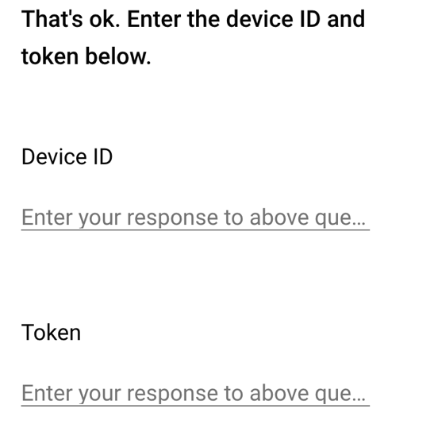

Insert the ID and Token or click the Scan icon to scan the registration
QR code.

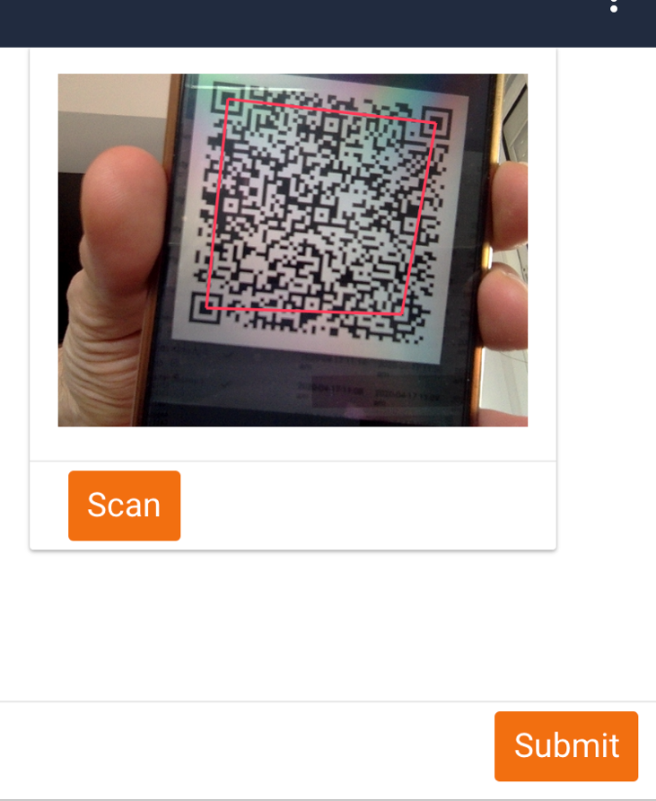

Click Submit when done. The next screen will show you some information
for this device. If it is correct select Yes, if the scanned device code
and ID correspond to a different device select No and start over with
the correct device code.

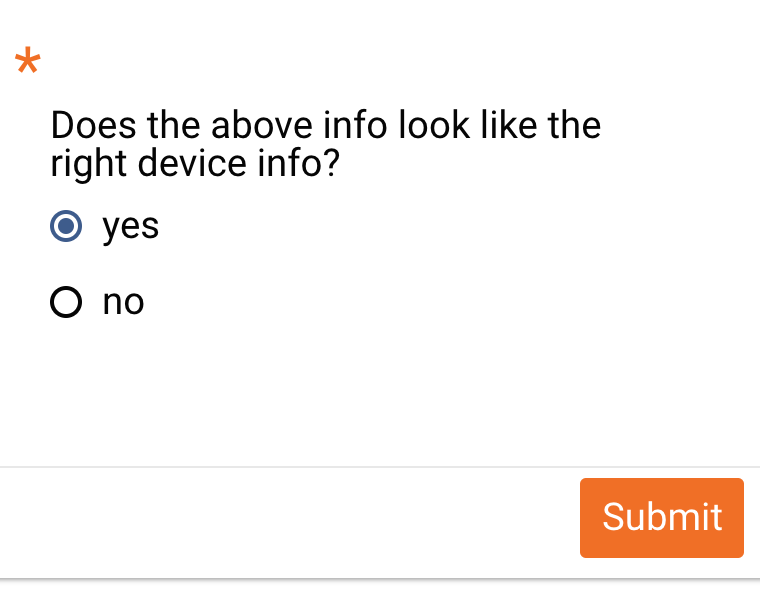

On the next screen you will see some synchronization information. The
app at this moment is contacting the server and obtaining users assigned
to your device location. If you have already collected data on another
tablet for this location, this data will also be pulled.

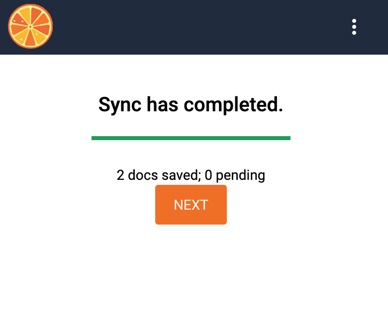

Click Next and then go to the Registration tap. Ask your administrator
to enter the admin password and enter your user information below. Click
submit when ready.

If you are an administrator handing off the tablet to a user, enter your
password and ask the user to enter their username and password. Here the
Year of Birth can be used by the user to reset their password in case
they forgot it.

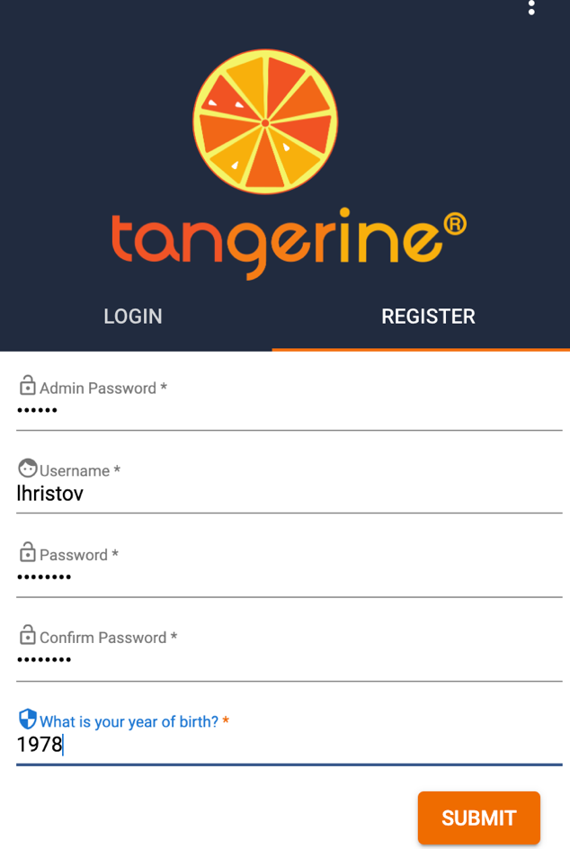

On the next screen you will see a dropdown of all users for this
location. Select the one that corresponds to you and click Submit.

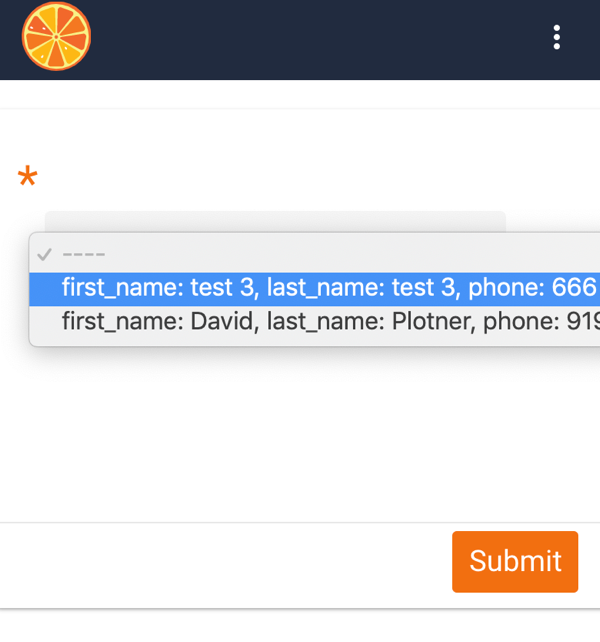

You will now see a screen similar to the one below where you can start
working

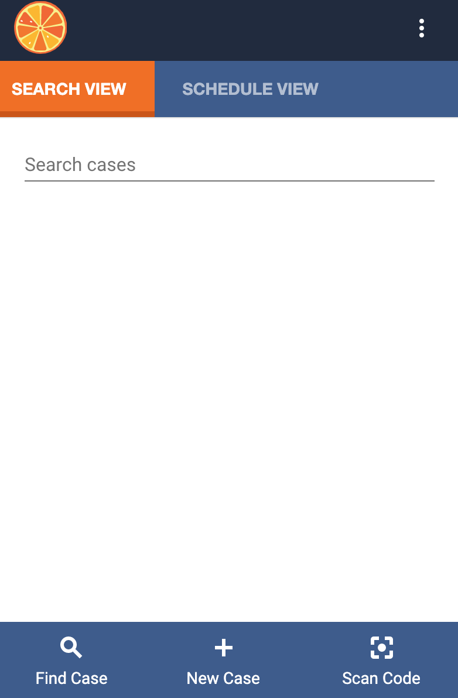

Installation in your Chrome browser
-----------------------------------

Tangerine can be installed and used offline in the Chrome browser. To do
this we follow similar installation instructions as above.

!!! Warning 
    You must be online on to do the initial installation.**

The first step is to follow the link for Browser installation that has
been given to you or copied directly after it's generation in the
backend. Copy the link and paste it in the Chrome's address bar. You
will see a screen indicating that the app is being installed.

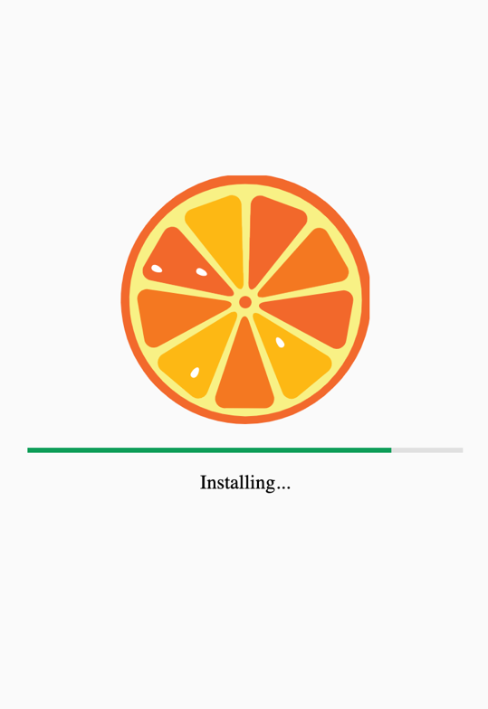

After a successful installation you will receive a confirmation screen
like the one below. **Do not click the link to proceed**.

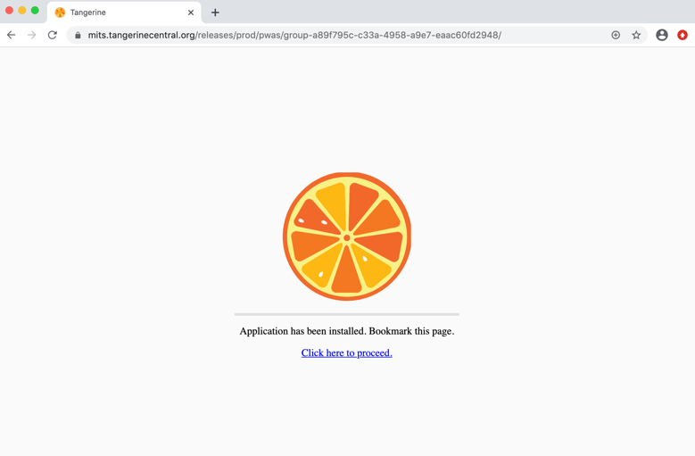

Click the + icon beside the address bar to install Tangerine in your
browser. A popup will open to give you the option to install the app.
Click Install

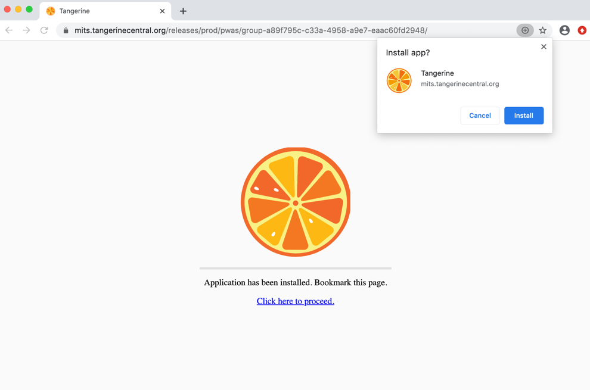

Depending on your browser setup, you may be asked to create a shortcut
on your desktop or in your program folder or the browser may close
automatically and offer you the link for Tangerine to open. If you see
the link click it

If you cannot find it type this into the address bar of your browser:
[[chrome://apps/]{.underline}](chrome://apps/)

!!! Warning     
    Always start Tangerine from the application icon and not from the URL address. Only one Tangerine instllation per browser profile is allowed.

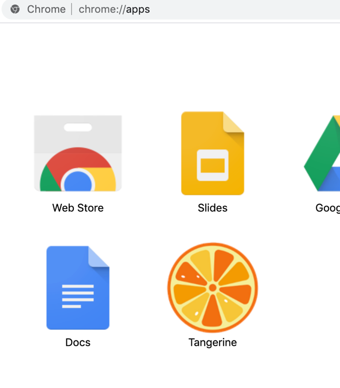

Click the Tangerine app to start the application.

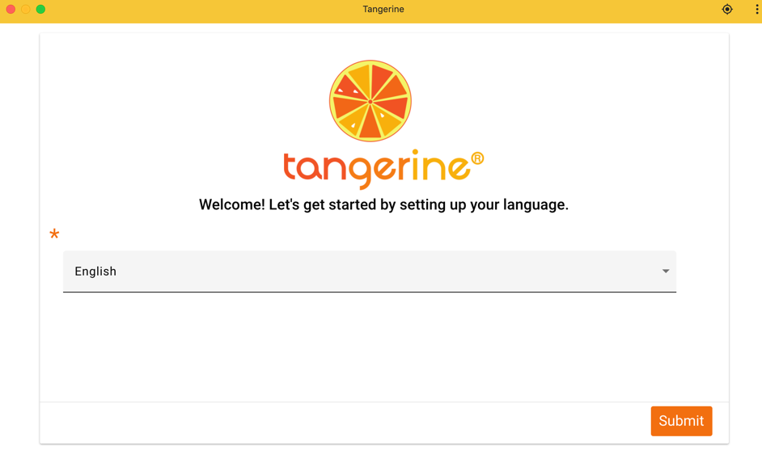

Select the language and click Submit

Now enter the administration password for this tablet. You may wish to
use the same admin password for all tables at your site. This same
password will be required each time a user is registering to use the app
on this device.

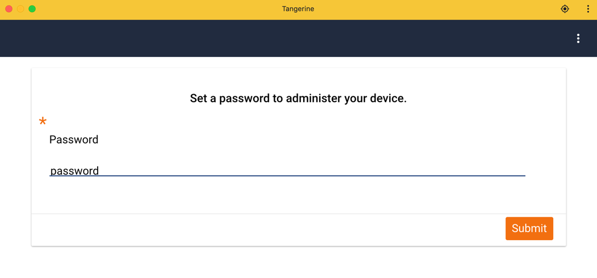

Select Yes if you have a device code or No if you are going to insert a
device ID and Token for the registration.

Insert the ID and Token or click the Scan icon to scan the registration
QR code. If your PC or laptop doesn't have a camera that can be used to
scan the barcode, you'd have to type in the ID and Token

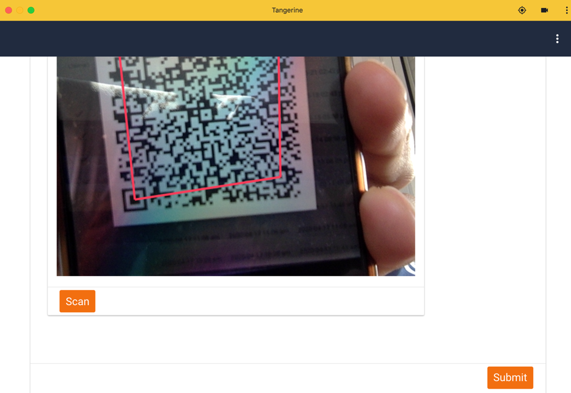

Click Submit when done. The next screen will show you some information
for this device. If it is correct select Yes, if the scanned device code
and ID correspond to a different device select No and start over with
the correct device code.

On the next screen you will see some synchronization information. The
app at this moment is contacting the server and obtaining users assigned
to your device location. If you have already collected data on another
tablet for this location, this data will also be pulled.

Click Next and then go to the Registration tap. Ask your administrator
to enter the admin password and enter your user information below. Click
submit when ready.

If you are an administrator handing off the tablet to a user, enter your
password and ask the user to enter their username and password. Here the
Year of Birth can be used by the user to reset their password in case
they forgot it.

On the next screen you will see a dropdown of all users for this
location. Select the one that corresponds to you and click Submit.

You will now see a screen similar to the one below where you can start
working

Synchronization 
===============

User setup
----------

Follow to below steps to prepare the Tangerine backend to allow
installation of your app on the user device or Chrome browser. The menu
items used during setup can be found under the Deploy link in the left
side navigation menu.

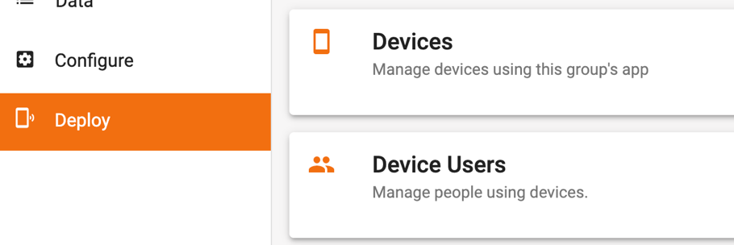

Click the Device Users section to create a new tablet user profile. On
this screen you will see a listing of all users already created. At the
bottom left of the screen there is a'+' icon which allows you to add a
new device user profile.

-   Click the + icon to create a user profile on the server

-   Fill in all information required in the profile and click Submit

-   You will see that next to the Submit button a blue check marks
    appears indicating that the profile was saved

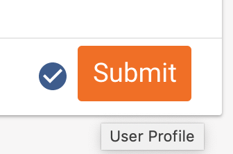

-   Repeat the above steps for all users

Device setup
------------

Now we have to create the 'virtual' devices that will be associated with
a real device or browser upon installation. The devices that you create
represent a real user device. Each virtual device can be associated with
a real tablet only once. After being claimed the device cannot be reused
(unless reset and the app re-installed). Each device requires that we
assign it to a particular location. This assigned location is
automatically attached to each form collected from the tablet. We can
also control the synchronization level. This level will indicate to
Tangerine what records should be kept in sync across tablets. If you
select to synchronize on a top level, all tablets will contain all
records collected over all of the facilities in under this top level. It
may be better to choose to synchronize only at the bottom level.

The device listing go to Deploy-\>Devices

-   Here, if you have some devices already created you will see a full
    listing with some other information

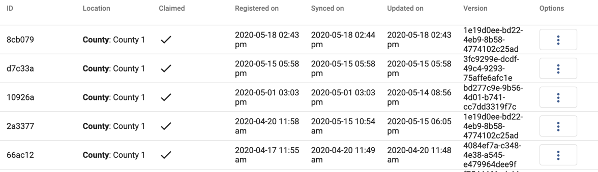

-   The device listing gives you:

    -   The ID of the device

    -   The assigned location

    -   Whether this device has already been used in an installation or
        not. A checkmark under Claimed indicates that it has been used.

    -   Registered on gives you the date this device was first
        registered

    -   The last synchronization date for this device

    -   Updated on is the date this device was last updated

    -   Version is the version of the application this device is running

    -   Under options you will have access to a menu allowing you to
        Edit, Reset, Delete, get The QR registration code for a device.

Create a new device by going to Deploy-\>Devices

-   Click the + icon at the bottom of the page

-   Note that you have the ID and Token listed here (can also be access
    by clicking Edit for a particular device on the device listing
    screen) In cases where the QR code cannot be sent to the site for
    installation you can also use the ID and Token to install Tangerine.

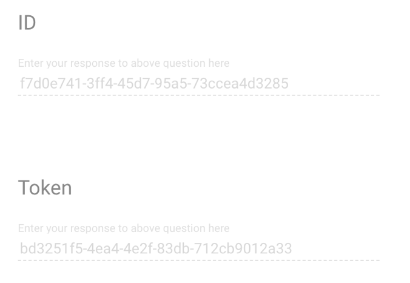

-   Select the location this device is assigned to

-   Select the synchronization level

-   Select the actual site to be used for synchronization. Be careful
    here not to assign the device to one location and select a different
    one for synchronization.

-   Click Submit

-   The device now shows up on the of the list and you can get the QR
    code for it by clicking the Options menu and selecting Registration
    Code

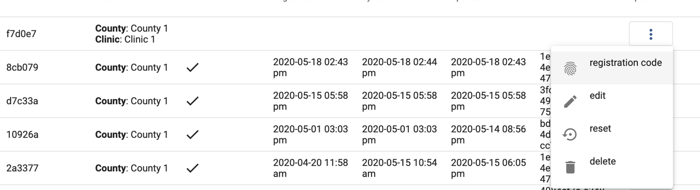

-   Repeat the above steps for all devices that you need to use on your
    project.

NOTE: you may wish to store the device ID and Token in a file for safe
keeping. Such a sample file can be found
[here](https://docs.google.com/spreadsheets/d/1T-aPKfWnCwgwp3J8NSOQmGOTcMvQRT1yfm85OkNBnTU/edit?usp=sharing). Put the device ID and the Token in the corresponding columns and the QR
code will be generated for you. Keep in mind that his worksheet
functions correctly only on Google Drive. You can also print this file
and distribute the installation codes on paper.

Device modification
-------------------

It may happen that you want to modify a device that is already in use.
Although you will be able to do that in the interface, this modification
is not pushed to the actual tablet. The way to go here is to apply the
modification reset the device, and send the new Registration Code or ID
and Token to the admin to reinstall the application. Make sure that
before re-installing the app all data is synchronized.

NOTE: You can edit all devices that have not been claimed yet.

To Edit a device, click the Edit button in the Options menu. Apply any
modifications and click Submit

To Delete a device , click the Delete button in the Options menu. Keep
in mind that any device that you delete will disallow this device from
synchronization or updates. Use this option if you have had one of your
devices stolen or lost.

To Reset a device, click the Reset button in the options menu. This
action will disallow the device from receiving updates or synchronizing
data. Use this option, if one of your staff members leaves and will no
longer use this device. Make sure data is synchronized before you reset
the device.

