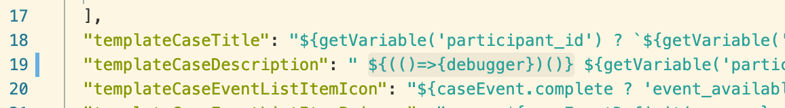
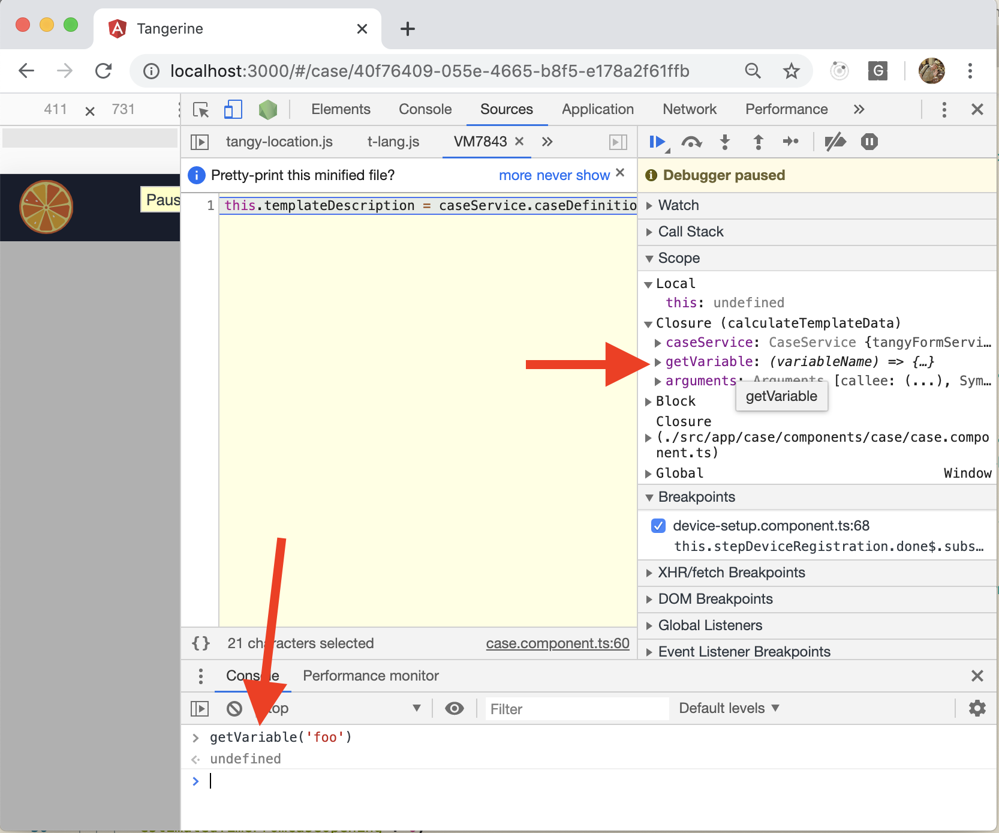

# Viewing Forms and Form Data

Use TangyFormService to retrieve form definitions and response data. The revision is used to get the correct version of the form.

```js
    this.formResponse = await this.tangyFormService.getResponse(this.eventForm.formResponseId)
    const tangyFormMarkup = await this.tangyFormService.getFormMarkup(this.eventFormDefinition.formId, this.formResponse.formVersionId)
```

But there are other ways of getting data out of Tangerine. First you need to see where you are getting data from.

## Mapping of components to forms

EventFormListItemComponent - listing of forms in an event
CaseEventListItemComponent - listing of events (such as Followup ANC Visits) in a case.

## Helper functions already in components

In the component for a list, helper functions may already expose the properties you need to populate a template. In EventFormListItemComponent, notice the variable exposed:

```js
    const response = await this.formService.getResponse(this.eventForm.formResponseId)
    const getValue = (variableName) => {
// more code inside getValue();
      }, {})
// snip
    const caseInstance = this.case
    const caseDefinition = this.caseDefinition
    const caseEventDefinition = this.caseEventDefinition
    const caseEvent = this.caseEvent
    const eventForm = this.eventForm
    const eventFormDefinition = this.eventFormDefinition
    const formatDate = (unixTimeInMilliseconds, format) => moment(new Date(unixTimeInMilliseconds)).format(format)
    const TRANSLATE = _TRANSLATE
    eval(`this.renderedTemplateListItemIcon = this.caseDefinition.templateEventFormListItemIcon ? \`${this.caseDefinition.templateEventFormListItemIcon}\` : \`${this.defaultTemplateListItemIcon}\``)
    eval(`this.renderedTemplateListItemPrimary = this.caseDefinition.templateEventFormListItemPrimary ? \`${this.caseDefinition.templateEventFormListItemPrimary}\` : \`${this.defaultTemplateListItemPrimary}\``)
    eval(`this.renderedTemplateListItemSecondary = this.caseDefinition.templateEventFormListItemSecondary ? \`${this.caseDefinition. v}\` : \`${this.defaultTemplateListItemSecondary}\``)
```
If there is not a response for a form, response will be false; therefore, if you do a getValue() in your template, be sure to test if response is true. 

If you wish to display the startDatetime in your template, note that is is part of the response object - it is returned as response.startDatetime. In other cases - for values inside the form - use getValue(variableName) - but test if response is true first! Also, remember that the variableName is one of the id's in the inputs array, which is inside each item in the items array. 

## Testing your templates

Here's an easy way to test your template code: in the js console, use the copy() function to copy the value for your template:

```js
copy(this.caseDefinition.templateEventFormListItemSecondary)
```
Then add the fields or functions you need. In this case, I'm adding a getValue:

```js
`<t-lang en>Status</t-lang><t-lang fr>Statut</t-lang>: ${!eventForm.complete ? '<t-lang en>Incomplete</t-lang><t-lang fr>Incomplète</t-lang>' : '<t-lang en>Complete</t-lang><t-lang fr>Achevée</t-lang>'} ${response ? `Version: ${getValue("content_release_version")}`: ''}`
```

Output:
```js
"<t-lang en>Status</t-lang><t-lang fr>Statut</t-lang>: <t-lang en>Complete</t-lang><t-lang fr>Achevée</t-lang> Start date: 3/13/2020, 11:25:19 AM"
```

Note that I was testing for existence of response, and also nesting templates to show the "Version" text if there was a value for content_release_version.

Another example:

`<t-lang en>Status</t-lang><t-lang fr>Statut</t-lang>: ${!eventForm.complete ? '<t-lang en>Incomplete</t-lang><t-lang fr>Incomplète</t-lang>' : '<t-lang en>Complete</t-lang><t-lang fr>Achevée</t-lang>'} ${response ? `Start date: ${response.startDatetime}`: ''}`

## debugging templates

To make the dev tool stop on a breakpoint in a Case Definition's template, add the following debugger statement to the content of the template.

```js
${(()=>{debugger})()}
```



When that template loads, the Chrome devtools will pause and you can inspect local variables/functions available and try running them in the console. Note that different templates will have different helper functions and variables available.




