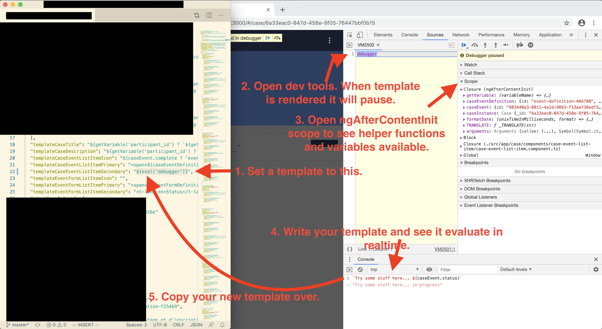

# Case Management Group (experimental)

Case Management allows us to define Case Definitions for different purposes such as following a participant in a drug trial over the course of many events, where each event may require many forms to be filled out. In order to create and find cases, you will need to configure the `"search"` as the `"homeUrl"` value in `app-config.json`.

## Configuring Cases
Case Management allows us to define Case Definitions for different purposes such as following a participant in a drug trial over the course of many events, where each event may require many forms to be filled out.

To configure cases, there are four files to modify.

First add a reference to the new Case Definition in the `case-definitions.json`. Here is an example of a `case-definitions.json` file that references two Case Definitions.

File: `case-definitions.json`
```
[
  {
    "id": "case-definition-1",
    "name": "Case Definition 1",
    "src": "./assets/case-definition-1.json"
  },
  {
    "id": "case-definition-2",
    "name": "Case Definition 2",
    "src": "./assets/case-definition-2.json"
  }
]
```

Then create the corresponding Case Definition file...

File: `case-definition-1.json`
```json
{
  "id": "case-definition-1",
  "formId": "case-definition-1-manifest",
  "name": "Case Definition 1",
  "description": "Description...",
  "startFormOnOpen": {
    "eventId": "event-definition-1",
    "eventFormId": "event-form-1"
  },
  "eventDefinitions": [
    {
      "id": "event-definition-1",
      "name": "Event Definition 1",
      "description": "Description...",
      "repeatable": false,
      "required": true,
      "eventFormDefinitions": [
        {
          "id": "event-form-definition-1",
          "formId": "form-1",
          "name": "Form 1",
          "required": true,
          "repeatable": false
        }
      ]
    }
  ]
}
```

### Debugging Case Templates


## Configuring search
The case references a Form in the `formId` property of the Case Definition. Make sure there is a form with that corresponding Form ID listed in `forms.json` with additional configuration for search.

File: `forms.json`
```json
[
  {
     "id" : "case-definition-1-manifest",
     "type" : "case",
     "title" : "Case Definition 1 Manifest",
     "description" : "Description...",
     "listed" : true,
     "src" : "./assets/case-definition-1-manifest/form.html",
     "searchSettings" : {
        "primaryTemplate" : "Participant ID: ${searchDoc.variables.participant_id}",
        "shouldIndex" : true,
        "secondaryTemplate" : "Enrollment Date: ${searchDoc.variables.enrollment_date}, Case ID: ${searchDoc._id}",
        "variablesToIndex" : [
           "participant_id",
           "enrollment_date"
        ]
     }
  }
]
```

## Configuring two-way sync
Because you may need to share cases across devices, configuring two-way sync may be necessary. See the [Two-way Sync Documentation](feature-two-way-sync.md) for more details. Note that you sync Form Responses, and it's the IDs of that you'll want to sync in the `"formId"` of the Case Definition in order to sync cases.
