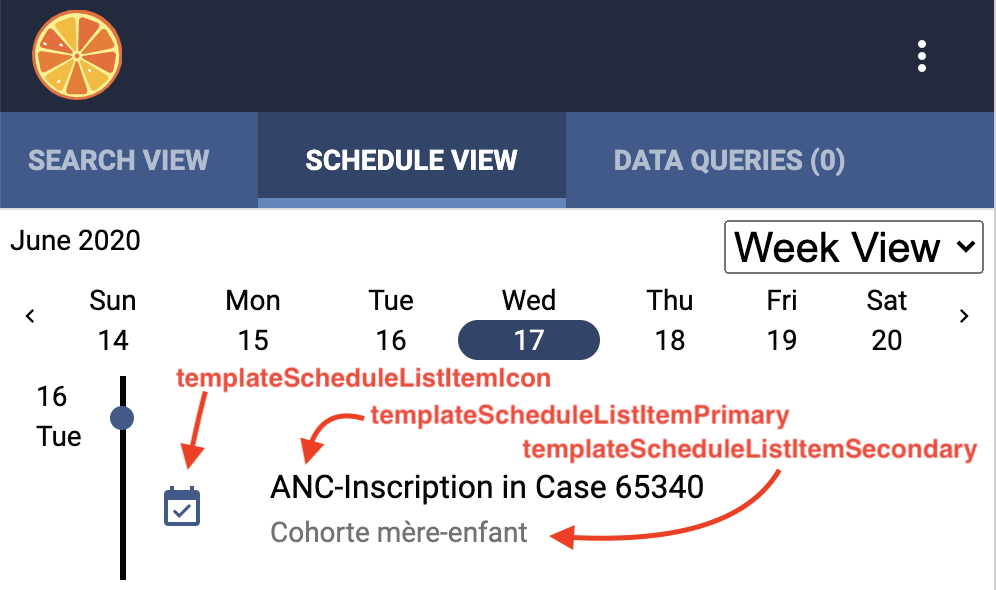

# Case Module 

Case Module allows us to define Case Definitions for different purposes such as following a participant in a drug trial over the course of many events, where each event may require many forms to be filled out. In order to create and find cases, you will need to configure the `"case-home"` as the `"homeUrl"` value in `app-config.json`.

## Configuring Cases
Case Module allows us to define Case Definitions for different purposes such as following a participant in a drug trial over the course of many events, where each event may require many forms to be filled out.

To configure cases, there are four files to modify.

First add a reference to the new Case Definition in the `case-definitions.json`. Here is an example of a `case-definitions.json` file that references two Case Definitions.

File: `case-definitions.json`
```
[
  {
    "id": "case-definition-1",
    "name": "Case Definition 1",
    "src": "./assets/case-definition-1.json"
  },
  {
    "id": "case-definition-2",
    "name": "Case Definition 2",
    "src": "./assets/case-definition-2.json"
  }
]
```

Then create the corresponding Case Definition file...

File: `case-definition-1.json`
```json
{
  "id": "case-definition-1",
  "formId": "case-definition-1-manifest",
  "name": "Case Definition 1",
  "description": "Description...",
  "startFormOnOpen": {
    "eventId": "event-definition-1",
    "eventFormId": "event-form-1"
  },
  "eventDefinitions": [
   {
      "id": "event-definition-1",
      "name": "Event Definition 1",
      "description": "Description...",
      "repeatable": false,
      "required": true,
      "eventFormDefinitions": [
        {
          "id": "event-form-definition-1",
          "formId": "form-1",
          "name": "Form 1",
          "required": true,
          "repeatable": false
        }
      ]
    }
  ]
}
```

### Case Definition Templates
As a Data Collector uses the Client App, they navigate a Case's hierarchy of Events and Forms. Almost every piece of information they see can be overriden to display custom variables and logic by using the Case Definition's templates. This section describes the templates available and what variables are available. Note that all templates are evaluated as Javascript Template Literals. There are many good tutorials online about how to use Javascipt Template Literals, here are [a couple of Javascript Template Literals examples](https://gist.github.com/rjsteinert/795fcc4f6899a337bcc5a9967557dcf2) that we reference often for things like doing conditionals and loops.

#### Schedule



`templateScheduleListItemIcon` default:
```
"templateScheduleListItemIcon": "${caseEvent.status === 'CASE_EVENT_STATUS_COMPLETED' ? 'event_note' : 'event_available'}"
```

`templateScheduleListItemPrimary` default:
```
"templateScheduleListItemPrimary": "<span>${caseEventDefinition.name}</span> in Case ${caseService.case._id.substr(0,5)}"
```

`templateScheduleListItemSecondary` default: 
```
"templateScheduleListItemSecondary": "<span>${caseInstance.label}</span>"
```

Variables available:
- `caseService`: [CaseService](https://github.com/Tangerine-Community/Tangerine/blob/master/client/src/app/case/services/case.service.ts)
- `caseDefinition`: [CaseDefinition](https://github.com/Tangerine-Community/Tangerine/blob/master/client/src/app/case/classes/case-definition.class.ts)
- `caseEventDefinition`: [CaseEventDefinition](https://github.com/Tangerine-Community/Tangerine/blob/master/client/src/app/case/classes/case-event-definition.class.ts)
- `caseInstance`: [Case](https://github.com/Tangerine-Community/Tangerine/blob/master/client/src/app/case/classes/case.class.ts)
- `caseEvent`: [CaseEvent](https://github.com/Tangerine-Community/Tangerine/blob/master/client/src/app/case/classes/case-event.class.ts)

### Debugging Case Definition Templates


## Configuring search
The case references a Form in the `formId` property of the Case Definition. Make sure there is a form with that corresponding Form ID listed in `forms.json` with additional configuration for search.

File: `forms.json`
```json
[
  {
     "id" : "case-definition-1-manifest",
     "type" : "case",
     "title" : "Case Definition 1 Manifest",
     "description" : "Description...",
     "listed" : true,
     "src" : "./assets/case-definition-1-manifest/form.html",
     "searchSettings" : {
        "primaryTemplate" : "Participant ID: ${searchDoc.variables.participant_id}",
        "shouldIndex" : true,
        "secondaryTemplate" : "Enrollment Date: ${searchDoc.variables.enrollment_date}, Case ID: ${searchDoc._id}",
        "variablesToIndex" : [
           "participant_id",
           "enrollment_date"
        ]
     }
  }
]
```

The variables you list in `variablesToIndex` will now be available for searching on with the Tablet level search.  To configure the QR code search on Tablets, in your `app-config.json`, there is a `"barcodeSearchMapFunction"` property. This is a map function for receiving the value of the Search Scan for you to parse out and return the value that should be used for search. A `data` variable is passed in for you to parse, and the return value is what ends up in the search bar as a text search.

Example:
```
if ((JSON.parse(data)).participant_id) { 
  return (JSON.parse(data)).participant_id
} else { 
  throw 'Incorrect format'
} 
```

## Configuring two-way sync
Because you may need to share cases across devices, configuring two-way sync may be necessary. See the [Two-way Sync Documentation](feature-two-way-sync.md) for more details. Note that you sync Form Responses, and it's the IDs of that you'll want to sync in the `"formId"` of the Case Definition in order to sync cases.


## Configuring the Schedule
One of the two tabs that Data Collectors see when they log into Tangerine is a "Schedule" tab. This schedule will show Case Event's on days where they are have an estimated day, scheduled day, and/or occurred on day. You can set these three dates on an event using the following APIs.

```
caseService.setEventEstimatedDay(idOfEvent, timeInUnixMilliseconds)
caseService.setEventOccurredOn(idOfEvent, timeInUnixMilliseconds)
caseService.setEventScheduledDay(idOfEvent, timeInUnixMilliseconds)
```


