# Case, Event and Form Archive and Unarchive

## Introduction

We have released an update to Tangerine which allows for the archiving and un-archiving of both events, and forms within events. This is an extension of the already existing functionality by which an entire case can be archived. The purpose of this is to empower data management teams using Tangerine to "clean up" messy cases where extraneous data has been added to a case in error, or by a conflict situation. The purpose of this document is to summarize both the configuration to enable this, and to demonstrate the use of these functions. This functionality will only apply to the web-based version of Tangerine, and will not be available on tablets.

## Enabling access to archive functions:

Under "Users and Roles", either a new role needs to be created, or additional rights will need to be granted to an existing role to provide access to the archive and unarchive functionality. To access this, login to Tangerine, and go to configure for the specific group that you are working with.

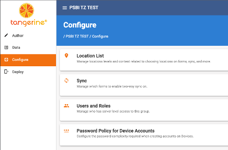

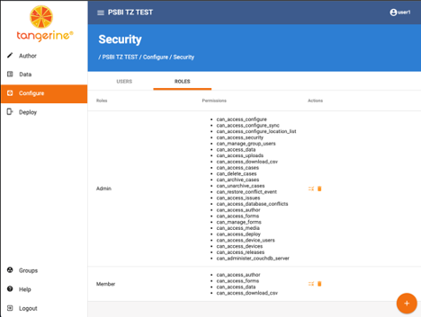

By default, the admin role will NOT have this functionality. You can either update the role, or create a new role as needed. Note that the USER1 account will have already have access to this functionality. We suggest that all users of the web interface be given their own accounts for better tracking of activity within Tangerine, and that you do not normally use the USER1 account. Under roles, you can either modify the admin account to add this access, or create a new role with access, and assign that role to users. Note that a single user can be assigned to more than one role. By clicking on the configure icon () next to the trash can icon, you can edit an existing role (such as the admin role above).

You will see that there are 4 separate permissions related to archiving. You can actively apply these as needed for your project team. There are 2 archive permissions to add (can\_archive\_events, and can\_archive\_forms), and two additional unarchive permissions (can\_unarchive\_events, and can\_unarchive\_forms). These are in addition to the can\_archive\_cases and can\_unarchive\_cases permissions which previously existed. For each site, there may be reasons to manage these each independently.

 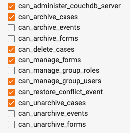

## Archiving and unarchiving of forms and events:
Once the correct roles have been applied to a user, they will be able to use the archiving/un-archiving functionality.

 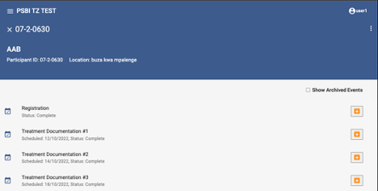

In the upper right corner, there is a kabob menu (  ) that can access the archive and delete functions at the case level. Note that we suggest NEVER using the delete function, as it is much harder to restore a deleted case.

 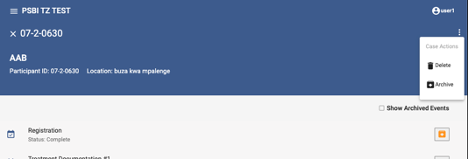

Select the "Archive" option, and then click "OK" to confirm the archiving of a case.

 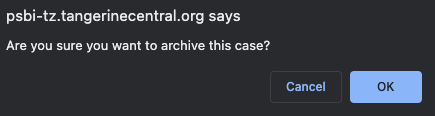

If you need to review an archived case, you can select the "View Archived Cases" checkbox on the cases screen.

 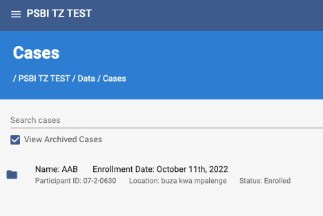

When you re-open an archived case, it shows with an indication that it is archived, and the menu will provide you with the option to un-archive it.

 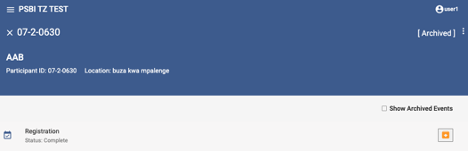

Selecting Unarchive will restore the case and all forms back to a normal (unarchived) status.

 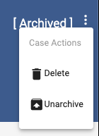

Additionally, this functionality will cascade down to the event and form level. If you have a duplicate event, or an event that was added in error. You can archive the event, and all the forms within the event by clicking on the "archive" icon ( 
  ) to the right of the event.

 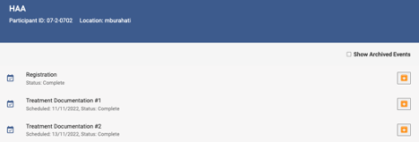

Click the icon and then confirm that you wish to archive the event by clicking "OK." 

 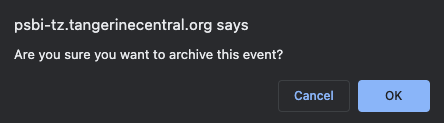

If you need to visualize an archived event, you can check the checkbox for "Show Archived Events." The archived event will show as greyed out, with an "Unarchive" icon next to it (  ). If you select an archived event, the forms within it will also be archived, but similarly are viewable by checking the "Show Archived Forms" box. The forms will be greyed out and show the unarchive button to the right.

 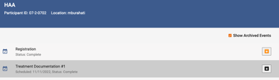

Clicking on the unarchive button for an event will prompt you to confirm if you want to unarchive the event.

 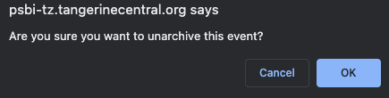

 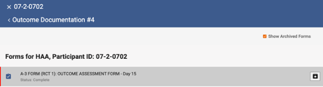

Unarchiving an event will cascade down, and automatically unarchive any associated forms for that event. If you need to unarchive an event, and archive SOME forms within that event, you can unarchive, and then go into the event to archive individual forms within that event as needed.