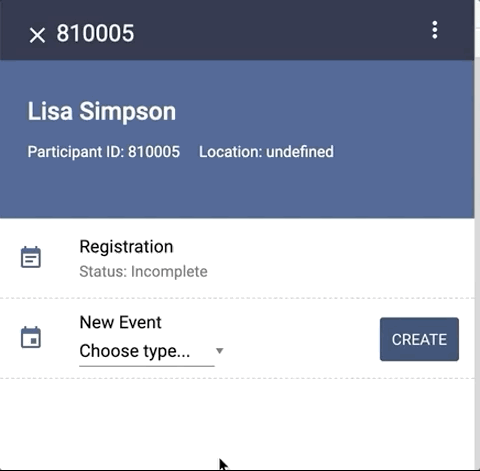

# How to use Form Response data in an Event Form Listing

The following tutorial uses content from the `case-module` Content Set found [here](https://github.com/Tangerine-Community/Tangerine/tree/master/content-sets/case-module). 



## Step 1: On submit of a Form, capture data as a Case Level variable
In Step 2, we'll template out data for the Event Form listing, but before we can do that we need to transfer some data from a form up to the Event Form data in the Case using the `T.case.setEventFormData` API.

File: `./template-event-form-listing/form.html`
```html 
<tangy-form
  id="template-event-form-listing"
  title="Template Event Form Listing"
  on-submit="
    T.case.setEventFormData(caseEvent.id, eventForm.id, 'title', getValue('title'))
  "
>
  <tangy-form-item id="item-1">
    <tangy-input type="text" name="title" label="Set the custom title for this Event Form."></tangy-input>
  </tangy-form-item>
</tangy-form>
```

## Step 2: Use `templateCaseEventListItemPrimary` property in the Case Definition to print the Case variable in the Event Listing
After a user has submitted the Event Form mentioned above, we can now use the Event Form data for templating out Event listings. In the Case Definition, we add ternary to check if the variable exists, if it does then print it out in the listing, else show the name of the Event Form Definition. 

Section of File: `./case-definition-1.json`
```
  "templateEventFormListItemPrimary": "<span>${eventForm?.data?.title ? eventForm.data.title : eventFormDefinition.name}</span>",
```

