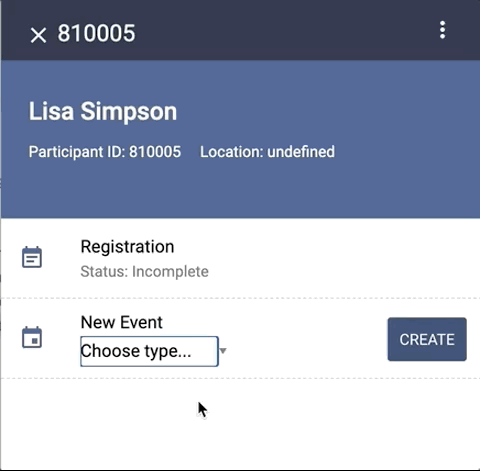

# How to use Form Response data in an Event Listing

The following tutorial uses content from the `case-module` Content Set found [here](https://github.com/Tangerine-Community/Tangerine/tree/master/content-sets/case-module). 



## Step 1: On submit of a Form, capture data as a Case Level variable
In Step 2, we'll template out data for the event listing, but before we can do that we need to transfer some data from a form up to the Case level variable. In the example below, we bubble up the `title` variable in the form to a `title` variable on the Case. However, note how we prepend the current Event ID on the case level title variable. This is important to do if you are going to bubble up variables that may have the same name across events. By prepending the current Event ID, we guarantee that any other Event that bubbles up a `title` variable will not overwrite the `title` variable for this Event.

File: `./template-event-listing/form.html`
```html 
<tangy-form
  id="template-event-listing"
  title="Template Event Listing"
  on-submit="
    T.case.setVariable(`${caseEvent.id}-title`, getValue('title'))
  "
>
  <tangy-form-item id="item-1">
    <tangy-input type="text" name="title" label="Set the custom title for this event."></tangy-input>
  </tangy-form-item>
</tangy-form>
```

## Step 2: Use `templateCaseEventListItemPrimary` property in the Case Definition to print the Case variable in the Event Listing
After a user has submitted the Event Form mentioned above, we can now get that Case level variable when templating out Event listings. In the Case Definition, we add ternary to check if the variable exists, if it does then print it out in the listing, else show the name of the Event Definition.

Section of File: `./case-definition-1.json`
```
  "templateCaseEventListItemPrimary": "<span>${T.case.getVariable(`${caseEvent.id}-title`) ? T.case.getVariable(`${caseEvent.id}-title`) : caseEventDefinition.name}</span>",
```

