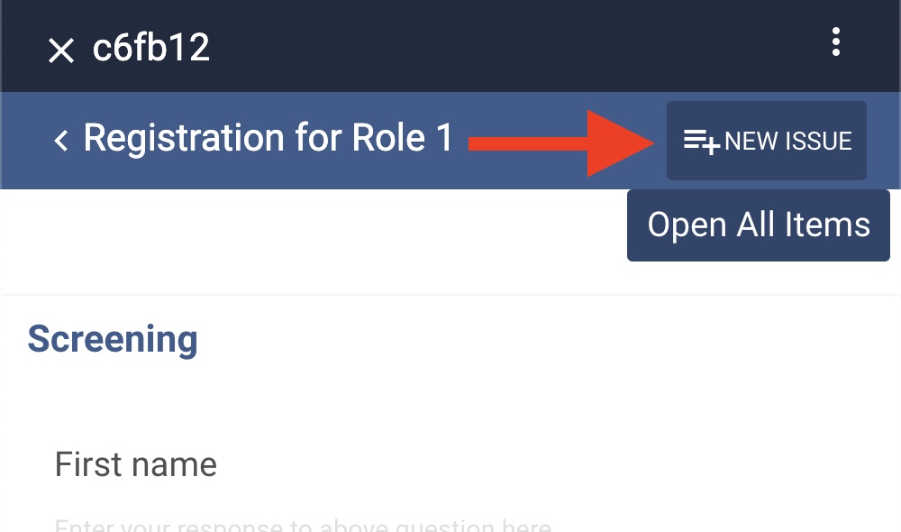

# On Device Data Corrections

Enable "Allow Creation of Issues" in your App Config for Devices and Data Collectors will be able to propose changes to data that has already been submitted. After the Data Collector syncs, Data Managers may view those proposals in the Issues UI in their corresponding group, then comment or choose to merge the issue. 

- [Video Demo of configuration and usage](https://youtu.be/xWXKubQNLog)



## Configuration
- To enable Devices to create Issues, add `"allowCreationOfIssues": true` to the group's `client/app-config.json` and release to Devices.
- To allow Devices to see Issues that have been created on the Device or been synced down to the Device, add `"showIssues": true`to the group's `client/app-config.json` and release to Devices.
- To template out the resulting Issue title and descriptions, add `templateIssueTitle` and `templateIssueDescription` to Case Definitions.
  - Example template for Issue Title: `Issue for ${caseService.getVariable('study_id')} (${caseService.getVariable('firstname')} ${caseService.getVariable('surname')}, ${caseService.getVariable('village')}) by ${userId}`

## On Device Data Merge using Issues

Optionally, enable "Allow Merge of Issues" in your App Config for Data Collectors on Devices to see the "Commit" button on Issues. Clicking the "Commit" button will take the form and case changes in the proposal and make them the current version that appears in the case and form response. 

Although the "Merge" setting can be available for all Data Collectors, it is best practice to require some oversite for data collectors to merge issues. The Data Manager can set [User Roles](https://docs.tangerinecentral.org/editor/case-module/role-base-access/) to control.

To allow merge on tablet by user role, add user role (defined in user-profile.html) the "update" permissions section for event definitions or form definitions in the case definition file. For example, the case definition file excerpt below would allow all users except the "data_collector_role" to merge cases. 

```
{
    "id": "hosehold-case",
    "formId": "household-case-manifest",
    ...
    "eventDefinitions": [
      {
        "id": "enrollment-event",
        "name": "Household Baseline Visit",
        "description": "",
        "repeatable": false,
        "estimatedTimeFromCaseOpening": 0,
        "estimatedTimeWindow": 0,
        "required": true,
        "permissions": {
          "create": ["admin"],
          "read":   ["admin", "data_manager_role", "data_collector_role"],
          "update": ["admin", "data_manager_role"],
          "delete": ["admin"]
        },
```

## Configuration
1. Consider which strategy best allows data collectors to merge corrections while providing oversight to Issues.
2. To enable Devices to Merge Issues, add `"allowMergeOfIssues": true` to the group's `client/app-config.json` and release to Devices.
3. Add User Role permissions to the case definitions file

