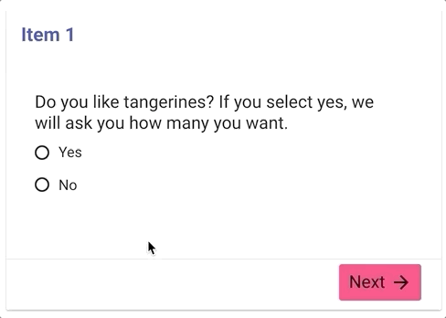
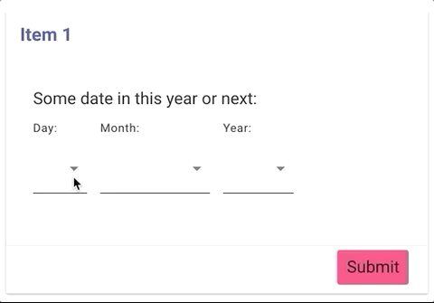
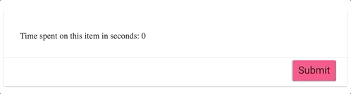
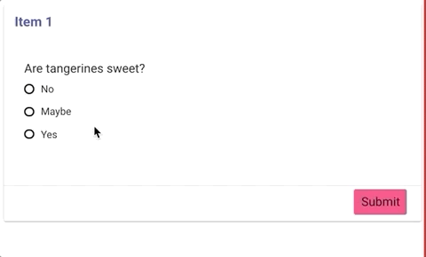

# The Tangerine Form Editor's Cookbook
Examples of various recipes for Tangerine Forms collected throughout the years. To create your own example, remix the [example](https://glitch.com/edit/#!/remix/tangy-form-example-template) on glitch.com.

## Skip a question based on input in another question
In the following example we ask an additional question about tangerines if the user indicates that they do like tangerines.

[Run example](https://skip-question-based-on-input.glitch.me/) - [Open Editor](https://skip-question-based-on-input.glitch.me/#edit) - [View Code](https://glitch.com/edit/#!/skip-question-based-on-input)

## Skip sections based on input
In the following example, wether or not you answer yes or no to the question, you will end up on a different item.

[Run example](https://skip-sections-based-on-input.glitch.me/) - [Open Editor](https://skip-sections-based-on-input.glitch.me/#edit) - [View Code](https://glitch.com/edit/#!/skip-sections-based-on-input)

## Valid by number of decimal points
In the following example, we validate user input by number of decimal points.

[Run example](https://valid-by-number-of-decimal-points.glitch.me/) - [Open Editor](https://valid-by-number-of-decimal-points.glitch.me/#edit) - [View Code](https://glitch.com/edit/#!/valid-by-number-of-decimal-points)

## Valid if greater or less than other input
[Run example](https://valid-if-greater-or-less-than-other-input.glitch.me/) - [Open Editor](https://valid-if-greater-or-less-than-other-input.glitch.me/#edit) - [View Code](https://glitch.com/edit/#!/valid-if-greater-or-less-than-other-input)

## Allowed date range based on today
[Run example](https://allowed-date-range-based-on-today.glitch.me/) - [Open Editor](https://allowed-date-range-based-on-today.glitch.me/#edit) - [View Code](https://glitch.com/edit/#!/allowed-date-range-based-on-today)

## Flag choice as discrepancy and/or warning and show or hide content depending
[Run example](https://flag-discrepancy-or-warning-and-hide.glitch.me/) - [Open Editor](https://flag-discrepancy-or-warning-and-hide.glitch.me/#edit) - [View Code](https://glitch.com/edit/#!/flag-discrepancy-or-warning-and-hide)

## Indicate a mutually exclusive option in a checkboxes group such as "None of the above"
In the following example when you make a selection of a fruit and then choose one of the mutually exclusive options, your prior selections will be deselected.

[Run example](https://mutually-exclusive-checkbox-options.glitch.me/) - [Open Editor](https://mutually-exclusive-checkbox-options.glitch.me/#edit) - [View Code](https://glitch.com/edit/#!/mutually-exclusive-checkbox-options?path=index.html)

## Capture and show local date and time
Sometimes we want to show the user the local date and time to ensure their time settings are correct. 

[Run example](https://capture-local-date-and-time.glitch.me/) - [Open Editor](https://capture-local-date-and-time.glitch.me/#edit) - [View Code](https://glitch.com/edit/#!/capture-local-date-and-time)

## Show a timer in an item
Let's say you want to show a timer of how long someone has been on a single item. This calculates the time since item open and displays number of seconds since then in a tangy-box.

[Run example](https://show-a-timer-in-an-item.glitch.me/) - [Open Editor](https://show-a-timer-in-an-item.glitch.me/#edit) - [View Code](https://glitch.com/edit/#!/show-a-timer-in-an-item)

## Capture the time between two items
Sometimes we want to know how much time passed between two points in a form. This example captures, the `start_time` variable on the first item, then `end_time` on the last item. Lastly it calculates the length of time.

[Run example](https://capture-the-time-between-two-items.glitch.me/) - [Open Editor](https://capture-the-time-between-two-items.glitch.me/#edit) - [View Code](https://glitch.com/edit/#!/capture-the-time-between-two-items?path=index.html)

## Hard checks vs. soft checks
A "hard check" using "valid if" will not allow you to proceed. However a "soft check" using "warn if" will allow you to proceed after confirming.

[Run example](https://soft-checks-vs-hard-checks.glitch.me/) - [Open Editor](https://soft-checks-vs-hard-checks.glitch.me/#edit) - [View Code](https://glitch.com/edit/#!/soft-checks-vs-hard-checks)

## Set selected value in radio buttons
In the following example we set the value of a `<tangy-radio-buttons>`.

[Run example](https://set-value-of-tangy-radio-buttons.glitch.me/) - [Open Editor](https://set-value-of-tangy-radio-buttons.glitch.me/#edit) - [View Code](https://glitch.com/edit/#!/set-value-of-tangy-radio-buttons)

## Dynamically prevent proceeding to next section
In the following example hide the next button given the value of some user input.

[Run example](https://dynamically-prevent-next.glitch.me/) - [Open Editor](https://dynamically-prevent-next.glitch.me/#edit) - [View Code](https://glitch.com/edit/#!/dynamically-prevent-next)

## Proactive input validation 
In the following example we validate an input after focusing on the next input. This approach is more proactive than running the validation logic when clicking next or submit. 

[Run example](https://proactive-input-validation.glitch.me/) - [Open Editor](https://proactive-input-validation.glitch.me/#edit) - [View Code](https://glitch.com/edit/#!/proactive-input-validation)

## Content Box with Tabs 
In the following example we display content in a set of tabs.  

[Run example](https://tangy-form-tabs.glitch.me/) - [Open Editor](https://tangy-form-tabs.glitch.me/#edit) - [View Code](https://glitch.com/edit/#!/tangy-form-tabs)

## Dynamic Changing of Text Color 
In the following example we change the color of text depending on a user's selection.  

[Run example](https://dynamically-change-text-color.glitch.me/) - [Open Editor](https://dynamically-change-text-color.glitch.me/#edit) - [View Code](https://glitch.com/edit/#!/dynamically-change-text-color)

## Use skip-if to reference variable inside tangy-inputs-group
In the following example a `skip-if` refers to an other variable local to the group itself is in. The trick is using backticks around the variable name (not quotes) you are referencing and prepending the variable name you are referencing with `${context.split('.')[0]}.${context.split('.')[1]}.`.  

[Run example](https://skip-if-inside-tangy-inputs-groups.glitch.me/) - [Open Editor](https://skip-if-inside-tangy-inputs-groups.glitch.me/#edit) - [View Code](https://glitch.com/edit/#!/skip-if-inside-tangy-inputs-groups)

## Use valid-if to reference variable inside tangy-inputs-group
In the following example a `valid-if` refers to an other variable local to the group itself is in. The trick is using backticks around the variable name (not quotes) you are referencing and prepending the variable name you are referencing with `${input.name.split('.')[0]}.${input.name.split('.')[1]}.`.  Watch out for the gotcha of not using `input.name` instead of `context` like we do in a `skip-if`.

[Run example](https://valid-if-inside-tangy-inputs-groups.glitch.me/) - [Open Editor](https://valid-if-inside-tangy-inputs-groups.glitch.me/#edit) - [View Code](https://glitch.com/edit/#!/valid-if-inside-tangy-inputs-groups)

## Dynamic Location Level
In the following example we empower the Data Collector to select which Location Level at which they will provide their answer. This example can also be used in a more advanced way to base the level of location required for entry given some other set of inputs.

[Run example](https://dynamic-location-levels.glitch.me/) - [Open Editor](https://dynamic-location-levels.glitch.me/#edit) - [View Code](https://glitch.com/edit/#!/dynamic-location-levels)

## Prevent user from proceeding during asynchronous logic
Sometimes in a form the logic calls for running some code that is asynchronous such as database saves and HTTP calls. As this logic runs, we would like to prevent the user from proceeding in the form. This is a job for a `<tangy-gate>`. Tangy Gate is an input that by default will not allow a user to proceed in a form. The gate can only be "opened" by some form logic that set's that Tangy Gate's variable name's value to `true`. This gives your logic in your forms an opportunity to run asynchronously, blocking the user from proceeding, then when async code is done your code sets the the gate to open.

[Run example](https://tangy-gate-example.glitch.me/) - [Open Editor](https://tangy-gate-example.glitch.me/#edit) - [View Code](https://glitch.com/edit/#!/tangy-gate-example)

