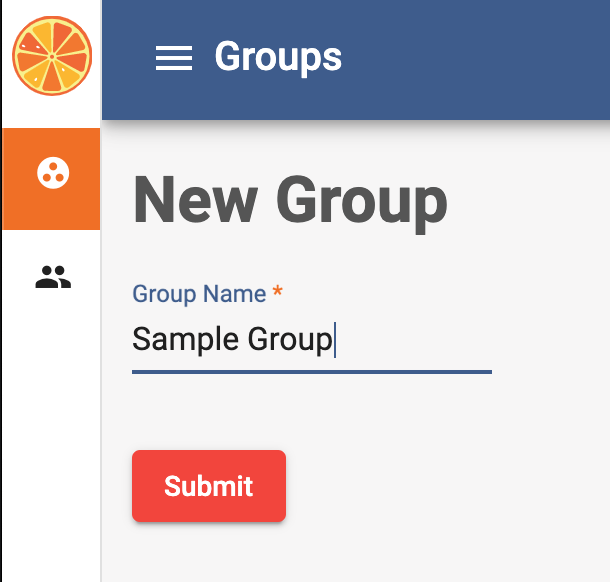

# Creating a New Group
Upon logging into your Tangerine instance, you will see a screen listing your Tangerine groups. You might think of groups as discrete data collection efforts that might contain several instruments or forms. If you have, e.g., a baseline data collection and an endline data collection for the same project, you might make these two different groups. When packaging your instruments into the apk (.apk is the application installation file format for Android devices) for installation on an Android device, Tangerine packages all instruments in a group. Thus, you should set up groups and categorize instruments accordingly.

On the main group listing page, click "+" button in the bottom right corner to create a new group

Enter a name for your group and click Submit

WARNING: If you are using the free service you are not able to create new groups.

If you are a Tangerine subscriber, or run Tangerine on your own server, the user1 account can be configured to be the only account with permissions to create new groups. If this is desired, please send a request for this configuration to support@tangerinehelp.zendesk.com Any Admin user can create a new group unless configured for the user1 account only