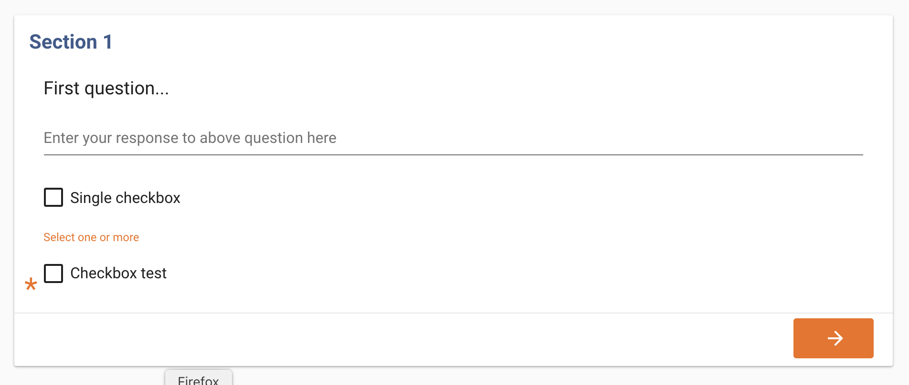
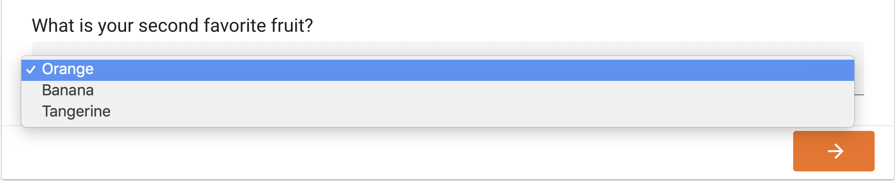
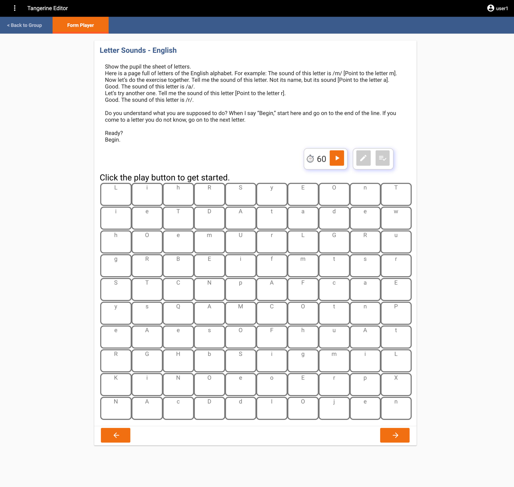

# Different Input Types

## Item Editor
The item editor screen is similar for many of the item types. It usually contains the following elements:

 

Variable name: This name has to be unique for any instrument/form, as this will be used for the CSV data output as column header with each observation/child assessed/interview being a row. Avoid special characters and spaces, use lowercase only (e.g., "age").

Label: This will be the item label/name that will be displayed to the user (e.g. "How old are you?")

Question number: If you input a number in here, you will see that the entire questions is moved to the right and the question number stands out when looking at the page. Use this if you are looking for a visual effect like this.

Hint Text: This field allows you to add text that acts as a hint for the user (e.g., "Enter child's age or year of birth, if known")

Toggle (On/Off) settings per question

Required: Selecting this checkbox marks the element as a required field. This ensures that users will enter a value before proceeding to other instrument sections or finalizing the instrument/form.

Disabled: Selecting this checkbox marks the element as inactive. The item is visible to the user on the tablet, but its value cannot be changed.

Hidden: Selecting this checkbox makes the element inactive AND invisible on the tablet.

PII - Personally Identifiable Information. This setting marks the input as PII which lets you remove this field from the CSV export file when this option is selected. Easily share data by de-identifying it whn using this option.

You will have access to two more tabs allowing you to add Skip Logic and Validation to your questions.

Conditional Display tab

**Skip if** -  Use this field to define logic for the input to be omitted if the condition is true.

**Show if** - Use this field to define logic for the input to be displayed when the condition is true.

[Find examples of skip logic here ](skip-logic.md)

Validation tab

**Warn if** - fail the user submission with a warning only once. This is to alert the user that perhaps they are entering something out of the defined boundaries. The warn if logic will allow the user to proceed if they click the Next/Submit button a second time.

**Warning Text** - The warning text to be displayed to the user when the condition is triggered.

**Valid if** - define logic to contain a valid definition of the input

**Error text** -  the text to be displayed when the above condition is not met.

[Find examples of validation logic here ](validation.md)

## GPS Item
Use the GPS item to record the location (longitude & latitude) of the user while filling in the instrument/form.

We suggest placing a GPS item always in its own section. Do not combine with other items.

When selecting to add an item of the GPS type, Tangerine presents the below item editor screen.

 

The following might be a way to configure this item:

Variable name: Enter "gps".

Hint Text: Leave blank

Hit "SUBMIT" to see the below item added to the section editor.

 

On the tablet this item will look like this:

 

## Location

This item type offers a dropdown listing of predefined location information such as, e.g., region, district, and school name. Before you add this item to your form, you need to upload a location list and configure Tangerine:

To see a video of how to do this Watch the video

First, decide what levels you would like to show and prepare a CSV file that contains your locations and ids. Each column header will present a location level (e.g. column A header might be region; column B header might be district, etc.). Make sure each level/column header contains only a single word and no spaces.

Second, define the location levels for Tangerine. Click Configure/Location Lists and add the desired levels using the '+' sign

Click "Create a New Location Level".

<iframe width="560" height="315" src="https://www.youtube.com/embed/RSJmNu7ef3U" frameborder="0" allow="accelerometer; autoplay; encrypted-media; gyroscope; picture-in-picture" allowfullscreen></iframe>

Enter the name of the "highest" location level under "Label" (e.g. region). Repeat this process for all other location levels, however, for each "child" level, select which is the parent level. E.g. in the case of district, the "Parent Level" would be "region", and so forth. Hit "Submit" to save.

!!! Warning
    You cannot delete location levels. Be careful and deliberate as you define them for your group. If you made a mistake or need to make changes, contact the Tangerine helpdesk.

Next, click the Import tab and select "Import CSV". Double check that your CSV file contains only those columns that you have defined as levels and spelled exactly the same!

Download a sample location list file with IDs:(https://drive.google.com/file/d/1y3X0aMJKRYx51--jPC_3OUkMpmkhyEn-/view) 

Once you selected the CSV, Tangerine will ask you to map the location levels you already defined to the column headers found in your csv file.

 

Click on the small arrows to select the matching column header. For each ID field, select "Map a column to a level and select "AutoGeneratedID" for the ID as shown in the example below.

 

Then click "Process CSV" as shown in the screen above. Once processing is completed, you will receive a notification like this:

 

Once you have successfully uploaded a location list and prepared Tangerine, you can add the location input item to your form. The following might be a way to configure this item, once you completed the above steps.

If you think that your location list may change significantly, and you'd like to re-upload it at some point thus not implementing any changes manually, consider adding manual IDs to your location file. In the instruction above, you saw how to add the Autogenerated ID that Tangerine inserts. These IDs, however, are not persisted when you re-upload your location file. In such cases, where you know that you'd rather re-upload the entire file, we recommend that you insert an ID column and you preserve those IDs across versions of your location list. By doing that you ensure that any matching on location IDs (and not on Location labels) will be persisted.

To upload a location file with IDs, first create those IDS in the Excel file. Then, on the Map location field instead of selecting Autogenerated ID, select the column representing the ID for the corresponding level.

!!! Warning
    We highly recommend that you create a location list export before importing any new data. Click the Export tab and export your current location list. ALways work with this export file to make sure your list is up-to-date

!!! Warning
     Upon upload you are wiping out the location list. All previous results collected will be missing the labels for those location and will contain only the old IDs; all data on the tablets under the Visits tab will show the ID rather than the label. This is why we highly recommend altering the location list manually or maintaining the IDs across different version of the location list in your Excel file.

Check out this Excel file to see a location list with IDs that you can import in Tangerine. The formula for generating the IDs can be copied to your own file: Download a sample location list file with IDs: (https://drive.google.com/file/d/1y3X0aMJKRYx51--jPC_3OUkMpmkhyEn-/view) 

 

Variable name: Enter "location".

Hint Text: Leave blank

Show levels (ex. county,subcounty): Enter "province,district,school"

Show meta-data: Leave blank

Hit "SUBMIT" to see the below item added to the section editor.

On the tablet this item will look like this:

 

!!! Warning
    Without a location list, no location will be displayed, and the item will be seen as "loading".

## Checkbox group (Checkbox, Radio Buttons, or Dropdowns)
This item type lets you define a checkbox item that lets a user pick one or more options.

The following might be a way to configure this item:

 

Variable name: Enter "books".

Label: Enter "What kind of books do you like to read?"

Hint Text: Enter "Tick all that apply"

Value (answer option): Enter the data value for the first answer option, e.g., "0"

Label (answer option): Enter the label for the first answer option, e.g., "None"

Hit "ADD ANOTHER" to add additional answer options, e.g.:

Value (answer option): "1"

Label (answer option): "Storybooks (fiction)"

Hit "ADD ANOTHER" to add additional answer options, e.g.:

Value (answer option): "2"

Label (answer option): "Books about real things (non-fiction)

When done adding all answer options, hit "SUBMIT".

!!! Warning
    The item type "CHECKBOX" only adds a single checkbox to the form, with the item label being the answer option label.

 

On the tablet this single checkbox item will look like this:

 

## Radio Buttons
Radio buttons are an item type used for items that allow for only one answer. The configuration for radio buttons is the same as for checkbox group with one exception. You will see that radio button options have a check mark to indicate which answer is correct. This is used in conjunction with the Threshold defined in the section header.

 

When you have a threshold defined as 4, and for each question there is only one question option defined as correct, Tangerine will discontinue (hide the questions) after 4 consecutive replies are given as not correct. You can use this in EGMA tasks or in any other scenario where this makes sense

On the tablet the radio button item will look like this:

 

## Dropdown
Dropdown is an item type used for items that allow for only one answer to be picked from a dropdown list of items. This item type is convenient when there are many options to choose from. The configuration for a dropdown item is the same as for checkbox group.

On the tablet the dropdown item will look like this:

 

## Timed Grid
This item type facilitates timed assessment approaches, e.g., to assess letter sound knowledge, oral reading fluency or math operations. The following might be a way to configure this item:

Variable name: Enter "letter_sound".

Number of columns: Enter the number of columns by which you'd like to organize the items. Enter, e.g. "4" (Tip: choose less columns for larger items, like words or operation problems)

Hint Text: Leave blank

Auto Stop: The autostop field defines the number of consecutive incorrect items, starting from the first one, after which the test stops automatically. For example, with an autostop value of 10, if a child has the first 10 items all incorrect, the test will stop. If a child has the first 4 items correct and then the following 10 items incorrect, the test will not autostop.

 

Mark entire rows: This option allows the user to mark and entire row of items as incorrect (e.g. if a child skipped an entire row of sounds in a letter sound assessment)

Duration in seconds: Enter the time allowed to complete this assessment, e.g. "60" for 60 seconds or one minute.

Options (each option separated by a space): Enter all grid items here. Separate each item by a space from the next; if you have extra spaces please remove them!

When done adding all answer options, hit "SUBMIT".

!!! Warning
    For these kids of assessments there are usually instructions preceding the assessment items. Insert those instructions as a "HTML CONTENT CONTAINER" item first, as shown below, followed by the "TIMED GRID" in the same section. We recommend to only feature the instructions (HTML Content) and Timed Grid in any one section of your instrument/form

On the tablet the timed grid item will look like this:

 

## HTML Content Container
This item type allows for flexible integration of headers, help text, or transition messages that do not require any user input or response. You can treat this container as a variable and hide or show different instructional text upon the selection of different options.

The following might be a way to configure this item:

Variable name: Enter "Assessor instructions".

Mark entire rows: This option allows the user to mark an entire row of items as incorrect (e.g. if a child skipped an entire row of sounds in a letter sound assessment)

Rows 1-X: Insert assessor instructions, use html tags to insert line breaks or formatting (e.g.   for a line break; <b>text</b> for bolding a piece of text, etc.).

When done adding all answer options, hit "SUBMIT".

 

On the tablet this HTML container item will look like this:

 

## Copying Items
If you have an element and/or content which is the same as a previous element (e.g., radio buttons) that you would like to insert into your instrument quickly, without having to click "INSERT HERE" again, there is a COPY feature that you can use to do this. First, enter your original content (e.g., variable name, labels, and values) and then click SUBMIT. Once the first step is complete, next you click on the  icon. Doing so automatically creates a duplicate of all your original content, except the variable name, which you will need to edit, if desired. In the image below, you can see that all duplicates are auto-populated with the name "widget," followed by an underscore, and a mix of letters and numbers (always different from the previous copy). If you would like to, you can edit all the content of the copy to fit your needs.

 
