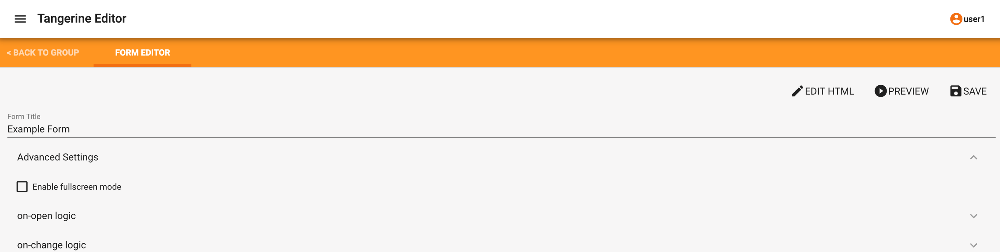
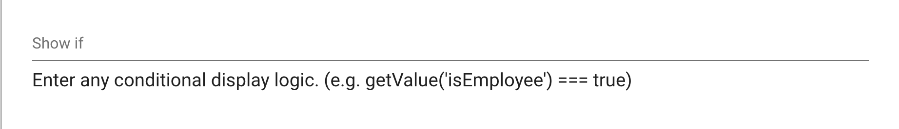
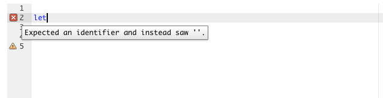
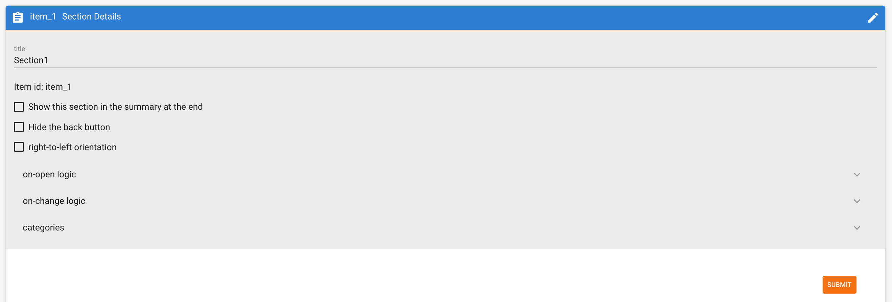

# Skip Logic

Every instrument/form, section, and individual item provides an interface for adding logic, e.g. skip logic, that controls the interactivity and presentation of the instrument, section, or item.

There are two types of skip logic that can be applied:

- On form level - used to skip an entire section and implement logic that is applicable to the entire form
- On section/page level
    - Most common case: You can implement those in the item's 'Skip If' field, or
    - Used for more complex conditions Implement the skip in the section's on-change logic

The functions that we use for skip logic are:

- getValue('name') - to check the value of input 'name'
    - Use this for Text, Number, Dates, Time, Radio buttons, or Drop down lists
- getValue('name').includes('value') - to check if 'value' is in the selected items of 'name'
    - Use this call to check if a value is in the list of selected values of a checkbox group input.
- grid specific functions - look at the end of this page for more information.

<b>Join skip logic conditions using the && (AND) and || (OR) operators 
getValue('repeatedgrade') == '1' && getValue('age') >= 1

Negate a condition using the ! (NOT) operator
getValue('repeatedgrade') != '1' Or !getValue('grades_taught').includes('1') </b>

## Logic at item level

You want to skip an item question:

Navigate to the "Show if" in the Item Editor.

In this example this item (e.g., "Which grade did you repeat?" will ONLY be shown if the response to the previous item (e.g., asking about whether the person ever repeated a grade) was "yes" (data value 1).

<b>getValue('repeatedgrade') == '1' </b>

Alternatively, for a preceding question that had "Other" as an answer option, the logic here might look like this:

<b>getValue('q10') == '9'</b>

Other examples might include a specific value of a preceding item. Use the below example for questions of type checkbox group, where more than one answer can be selected.

<b>getValue('q12').includes('5')</b>

!!! Warning
    The skip logic commands used in Tangerine are case-sensitive and space-sensitive. You must type precisely the name of the variables which you want to reference.

!!! Warning
     Use single straight quotation marks to demarcate variables names ', do NOT use single slanted quotation marks ' or double quotation marks ".

## Logic at instrument/form level
At the instrument/form level, accessing this logic editor is via advanced settings in the section editor.

Click on ADVANCED to see the screen below with "on-open" and "on-change" entries.

As outlined earlier, at the item level, such logic can be added in the "Show if" field in the item editor.

On-open and on-change

As the name suggest, on-open logic is only executed when the form is opened whereas on-change logic is always executed whenever a change happens in the whole form. When selecting on-open logic either at the instrument/form level or in the section editor, the following screen appears. The interface allows JavaScript logic to be incorporated into the instrument.

## (Skip) Logic Examples

You want to skip an entire section:

Navigate to and select the "on-change" at the instrument/form level. This logic will not work if you insert it in a section (it must be defined on form level)

In this example, the section gets skipped based on responses from a previous item, e.g., if the respondent answered negatively to a previous question "Do you have children?". Note that the sectionID is provided in Tangerine in the section details as shown below. Form level skip logic is used to present or hide an entire section page to the user. This is very useful when managing a workflow and you need to display some sections but hide others according to the selected option for a question. For example, you can show a certain section only for grade 1 and hide it if grade 2 is selected.

    :::javascript
    if(getValue('children') == '1')
    {sectionEnable('item_1')}
    else
    {sectionDisable('item_1')}

You want to hide a set of items based on responses to an item in a previous section:

Navigate to and select the "on-open" at the section level.

In this example several items in this section are hidden based on the participant's response to the item about the child's schooling experience in a previous section.
    
    :::javascript
    if(getValue('school') == '1')
    {itemShow('grade')
    itemShow('repeatedgrade')
    itemShow('dropout')}
    else
    {itemHide('grade')
    itemHide('repeatedgrade')
    itemHide('dropout')}

You want to hide a set of items based on responses to two items in a previous section:

Navigate to and select the "on-open" at the section level.

In this example the item "teachers_name" should only be shown if the participant's previous response to "teacher_available" was yes = 1 AND if the participant' previous response to "class_selected" was "1".

    :::javascript
    if(getValue(' teacher_available') === '1' && getValue('class_selected') === '1' )
    {itemShow('teachers_name')}
    else
    {itemHide('teachers_name')}

The Logic interface offer syntax highlighting. This is handy when you have errors in your code. Below is an example of an error and sample message.

## Logic at section level
At the section level, the logic editor can be accessed by editing the Section Details clicking the pen icon on the right of the blue bar (where one can also rename the section).

## Skip logic with grid specific functions
You may be in the situation where you are required to perform a skip based on some results from a grid. We provide four functions that you can use in your skip logic to show or hide questions or sections based on the results of a grid.

Showing a question based on the number of attempted items on a grid

If you'd like to hide a question when the number of attempted items on a particular grid is over a certain threshold you can make use of the 'numberOfItemsAttempted(input)' function. If your grid variable is 'letter_sound' and the question you want to skip is 'Q_1' then in the question Q_1 I can insert the below skip logic(under Show If) to show it only when the number of attempted items on the grid is greater than 10

    :::javascript
    numberOfItemsAttempted(inputs.letter_sound > 10)

Showing a question based on the number of correct items of a grid

Sometimes it may be the case where you want to show a question only if there are a certain N items on the grid answered correctly. In those cases, we make use of the 'numberOfCorrectItems(input)' function. If your grid variable is 'letter_sound' and the question you want to skip is 'Q_1' then in the question Q_1 I can insert the below skip logic(under Show If) to show this question only when the number of correct items on the grid is greater than 0

    :::javascript
    numberOfCorrectItems(inputs.letter_sound) > 0

Show a question only if the grid did not auto stop

If you have set the autostop value of a grid with variable name 'letter_sound' and you want to show a question only when the grid did not discontinue due to a triggered auto stop, then you can insert the below logic into the question's Show If field:

    :::javascript
    typeof inputs.letter_sound != 'undefined' && inputs.letter_sound.gridAutoStopped

The use of the '!' gives us the opposite of the result returned by the function. If the grid stopped the result will be true. When we use the '!' in front of the function, it means that, when the grid did not stop we want a positive answer hence show the question.

Show a question based on the words per minute read on a grid

It may happen that you need to show a question only to advanced students. In those cases, we make use of the function 'itemsPerMinute(input)' This function returns the number of items per minute read by the student. We can use it, just as before, in the Show If input field of a question, like so:

    :::javascript
    itemsPerMinute(inputs.letter_sound) > 35

This call will force a question to be displayed only when the rate of reading was higher than 35 workds per minute.

NOTE: All of the above functions can also be used to show or a hide an entire section page.
