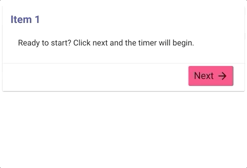

# The Tangerine Form Editor's Cookbook
Examples of various recipes for Tangerine Forms collected throughout the years.

## Skip a question based on input in another question
In the following example we ask an additional question about tangerines if the user indicates that they do like tangerines.

[Run example and see code](https://codepen.io/rjsteinert/pen/QWwQwPJ)

## Skip sections based on input
In the following example, wether or not you answer yes or no to the question, you will end up on a different item.

[Run example and see code](https://codepen.io/rjsteinert/pen/WNbjPjZ)

## Valid by number of decimal points
In the following example, we validate user input by number of decimal points.

[Run example and see code](https://codepen.io/rjsteinert/pen/bGNWzrr)

## Valid if greater or less than other input
[Run example and see code](https://codepen.io/rjsteinert/pen/jOEGbGK)

## Allowed date range based on today
[Run example and see code](https://codepen.io/rjsteinert/pen/mdyBeLm)

## Flag choice as discrepancy and/or warning and show or hide content depending
[Run example and see code](https://codepen.io/rjsteinert/pen/eYmGGbM)

## Indicate a mutually exclusive option in a checkboxes group such as "None of the above"
In the following example when you make a selection of a fruit and then choose one of the mutually exclusive options, your prior selections will be deselected.

[Run example and see code](https://codepen.io/rjsteinert/pen/WNbMveY)

## Show a timer in an item
Let's say you want to show a timer of how long someone has been on a single item. This calculates the time since item open and displays number of seconds since then in a tangy-box.

[Run example and see code](https://codepen.io/rjsteinert/pen/abzYqvb)

<tangy-form id="my-form" title="My Form">
  <tangy-form-item id="item1" 
    on-open="
      const openTime = Date.now()
      setInterval(() => {
        inputs.timer.innerHTML = `${Math.floor((Date.now() - openTime)/1000)}`
      }, 50)
    "
  >
     <tangy-box name="timer"></tangy-box>
  </tangy-form-item>
</tangy-form>

## Capture the time between two items
Sometimes we want to know how much time passed between two points in a form. This example captures, the `start_time` variable on the first item, then `end_time` on the last item. Lastly it calculates the length of time.

[Run example](https://fluorescent-value.glitch.me/) - [Open Editor](https://delightful-vicuna.glitch.me/) - [View Code](https://glitch.com/edit/#!/fluorescent-value)

