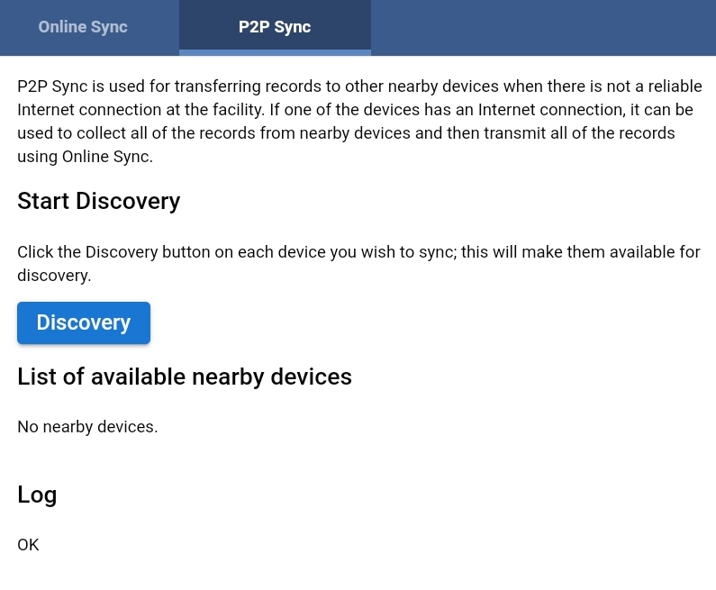
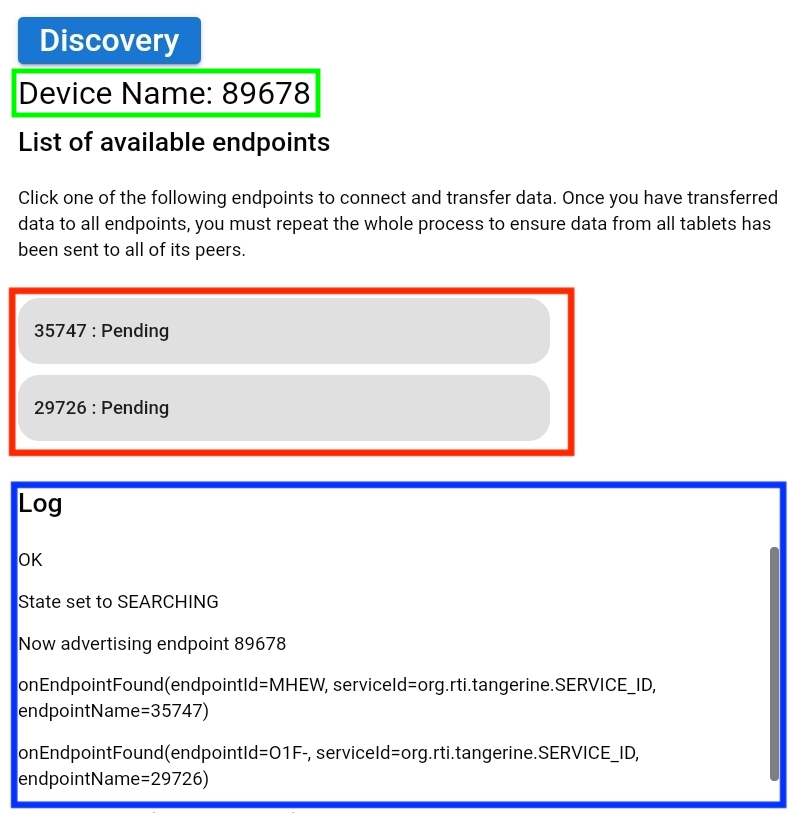
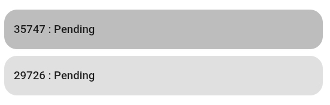
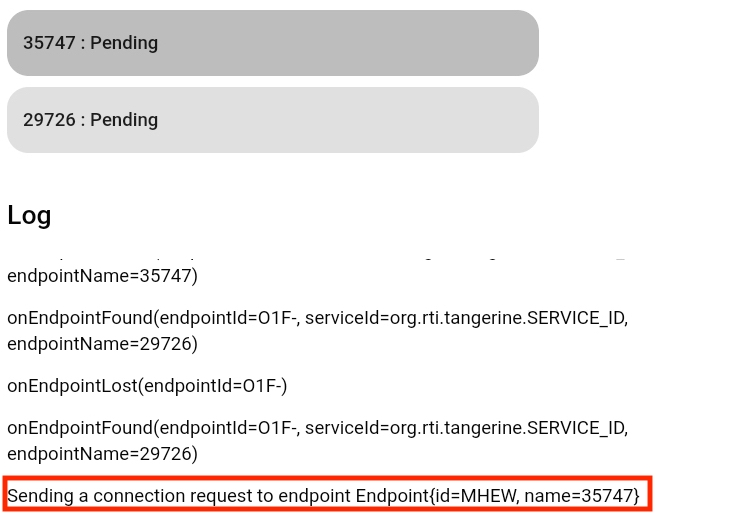
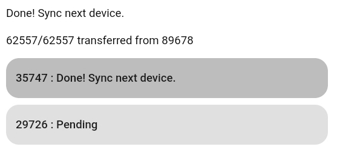

# Using P2P Sync for Offline Data Transfer

Use the P2P sync feature to transfer data between two or more tablets without an Internet connection.

Note: The tablets must be running Android 8 (Oreo) to use this function. 

In the following example, your tablet will be syncing data from your tablet to two other peers' tablets running Tangerine. The goal is to have the same data on all tablets. At the end of the process, data will be transferred from your tablet to the Internet.

## Accessing the P2P feature:
Each peer should select Sync from the menu.

 

Click the P2P Sync tab.

 

## Discovery

Gather in a circle with your peers. You and your peers should click the Discovery button. It does not matter who clicks first. 

## Endpoints

After a short time - a minute of two, the screen will show the device name, a list of available endpoints, and information about the data transfers in the Log. 

In the screenshot, your device name is highlighted in green (89678). The list of available endpoints - your peers' tablet names - is highlighted in red. A log of diagnostic information is highlighted in blue.

(Please note that the endpoint names are randomly generated. The names you see when using this feature will be different.)

## Syncing to an Endpoint

At this point in the process, your peers don't need to push any buttons; they only need to monitor the sync process for errors. Your tablet will be called the "master" tablet because it is controlling the sync operations. Once the "master" tablet has collected all of the data from the tablets, it can be connected to the Internet and upload all of this data to the server.

Ask your peers which one has the tab at the top of the endpoints list marked "35747 - Pending". Upon identifying that peer, ask them to pay attention to the screen. Now you may click "35747 - Pending" to initiate the data transfer. Notice how the endpoint button you click turns a darker shade of grey to indicate that it has been pressed.

Your tablet will send its data to your peer's tablet and then your peer's tablet will send its data back to your tablet, as well as the data you just sent. It's a little redundant, but this is part of reaching "eventual consistency" for all of the tablets. 

Notice that more data is added to the Log as the connection is made between the tablets and data transfer is initiated:

When the data transfer is complete, the endpoint list updates to show that you are ready to sync the next device ("Done! Sync next device.").  

Ask your peer if they received any error messages; if not, it is safe to proceed to the next peer's tablet. Ask the peer who has the tablet marked "29726" to be ready. Click the endpoint marked "29726: Pending".

When the data transfer is complete, the endpoint list updates to show that you are ready to sync the next device ("Done! Sync next device."). Ask your peer if they received any error messages. If none, great! Since you're at the end of the endpoints list, you are done with this first part.

## Do it again!

When you synced data from your "master" tablet to the second tablet, it received data from the first tablet, which was transferred to the "master" when it was sync'd. But the first tablet still needs to receive data from the second tablet. So, you will need to repeat this whole process, starting from the first tablet (35747) and then to the second (29726). (You actually don't need to sync again the final device sync'd in the process (29726), but it is easier to explain this process as a simple round-robin.) 

It may be useful to confirm that any records created on other tablets has indeed been transferred. 

English:

French: 

As mentioned earlier, once the sync process is complete (and you've done it twice), you may conect the "master" to the Internet and transfer data to the server.

## Tips
- Each time you visit the P2P page, your device name will change. It is a randomly generated number.
- Errors are highlighted in pink. It is fine to ignore the error marked "State set to CONNECTED but already in that state".  

