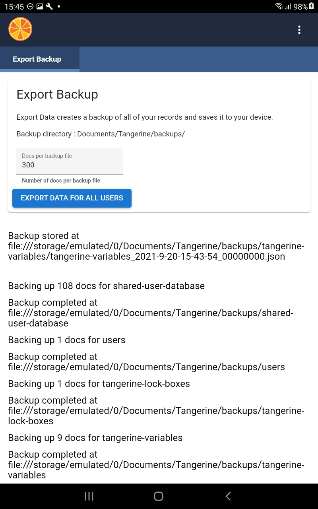
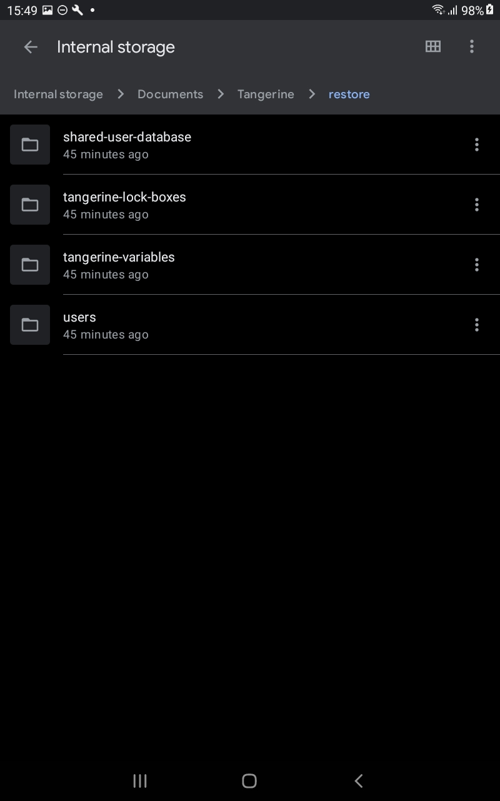
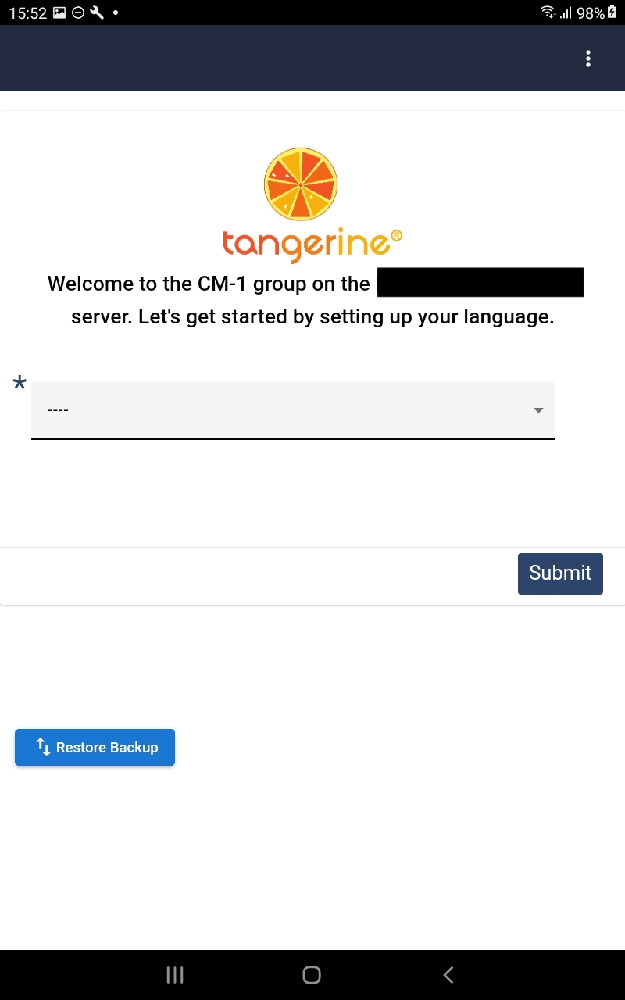
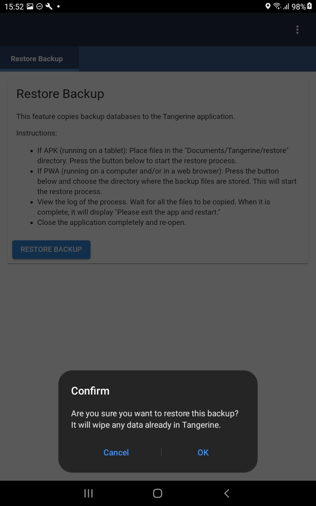
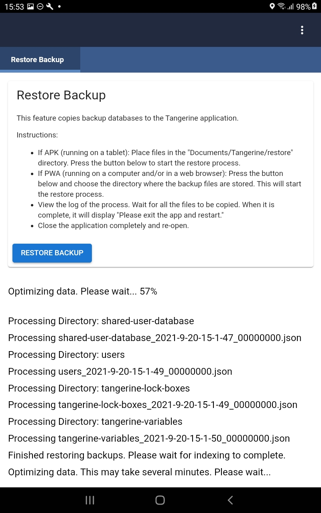

# Restoring from a Backup

## Backing up

The Export Backup feature is available from the right-hand menu by selecting "Export Data." 

Backups come in two types:
- tabs with in-app scryption: a single file per database
- tabs with device encryption: one directory per database, each of which contain many files.

The Export Backup screen displays the backup location, and if the device uses device encryption, an input where the user may modify the "Docs per backup file" parameter. 

Press "Export Data for all Users" to initiate export.

It will display a status message after each database backup is saved. The backup files will be saved in the `Documents/Tangerine/backups` directory. Use [Android File transfer tool](https://www.android.com/filetransfer/) to transfer the files. Save *all* of the database backup files or directories. There should be four databases backed up:

- shared-user-database
- users
- tangerine-lock-boxes
- tangerine-variables



## Restoring backups onto a fresh Tangerine app installation.

This only works for sync-protocol-2. 

Connect the tablet to the pc with a USB cable. Use Android File transfer or Samsung Smart Switch to browse to the `Documents/Tangerine/restore` directory. Copy all database files or directories generated by the Export Data command from the pc to the `restore` directory. 



Install the Tangerine app on the tablet.  DO NOT do the initial device setup (language selection/enter admin password/etc); instead, press the "Restore Backup" button to start the restore process. 



Read the instructions. When ready, press the "Restore Backup" button. It will display a confirmation prompt:



The restore feature logs the process for each database. After the databases have been restored, it initiates indexing of the databases:



After the restore process is complete, click the context button (|||) to close Tangerine and launch it again to load with the restored databases.

## Restoring form history

On a tablet, the history of every form response change is saved. An agglomeration of these changes is what is sync'd to the server. It is possible to view all of these changes using the tablet backup.

After restoring the database, open the app in DevTools and in the javascript console enter the following commands:

```javascript
const db = await T.user.getUserDatabase()
// docId is the document _id of the document you are trying to get the history from.
let docId = 'uuid'
const diffs = await T.tangyForms.getDocRevHistory(docId)
// get diffs into copy buffer
copy(diffs)
```

If there were any conflicts in the doc, they should be in _conflicts.

You may wish to list all issues:
```javascript
const issues = (await db.query('byType', {key: 'issue', include_docs: true}))
.rows
.map(row => row.doc)
.filter(issue => issue.resolveOnAppContexts && issue.resolveOnAppContexts.includes('CLIENT'))
```

## Viewing data from an encrypted backup

This is a deep dive - you probably don't need to do this. 

Ask user to go to Export Data and press "Export Data for all Users". The backup files will be saved in the `Android/data/org.rti.tangerine/files` directory. Transfer the shared-user-database file. Then ask the user to go to the About menu and read off the Device ID. 

In Fauxton, look up the device record in the group-uuid-devices database. Copy the value for the `key` property.

Building SqlCipher on MacOSX:

```shell script
git clone https://github.com/sqlcipher/sqlcipher.git
cd sqlcipher/sqlcipher
./configure --enable-tempstore=yes CFLAGS="-DSQLITE_HAS_CODEC -I/usr/local/opt/openssl/include/" LDFLAGS="/usr/local/opt/openssl/lib/libcrypto.a"
```

To use the compiled sqlcipher:

```shell script
sqlcipher/sqlcipher ~/Downloads/shared-user-database
```
In the sqlcipher console, enter the key:

```sql
PRAGMA key = 'secret-key-uuid-very-secret';
```

To list tables:

```sql
.tables
```
Output: 
```shell script
attach-seq-store  by-sequence       local-store
attach-store      document-store    metadata-store
```

## Recovering a corrupted database

Open the database:

```shell script
sqlcipher/sqlcipher ~/Downloads/shared-user-database
```
Enter the key:

```sql
PRAGMA key = 'secret-key-uuid-very-secret';
```

Run a check on the database. It will probably return something like "database disk image is malformed", which is not terribly useful:

```
sqlite>PRAGMA integrity_check;
```

Run the following commands to dump the sql and build a new database (kudos: https://blog.niklasottosson.com/databases/sqlite-check-integrity-and-fix-common-problems/):

```
sqlite>.output backup.db
sqlite>.dump
sqlite>.quit
>sqlite3 database_fixed.db
sqlite>.read backup.db
sqlite>.quit
```
If there were no errors, you should be able to query database_fixed.db. If not, open backup.db in a text editor and rummage through the sql statements.
