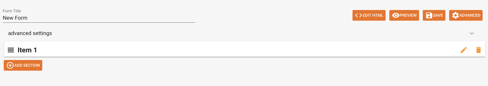

Creating a New Instrument/Form
==============================

When you create a group, it will show up in the list groups in your
Tangerine instance. Click on the group name to start creating your
instruments in Tangerine.

When you create a new group, Tangerine automatically creates an example
instrument/form. To add a form or instrument, click on the ADD FORM
button.

This will add an entry to the already existing list of forms but with a
default name, 'New Form'.

You will notice that there is also a User Profile form. This form
represents the profile each user has to fill in, after they create their
user login details on the tablet. All information that you require in
the user profile is attached to each record in the CSV export file. The
user profile represents your assessor's information.

Click the plus icon 

 to create a new record for the form.
This can be used for offline data entry. Be careful as this record is
saved in the database even if you do not reach the Submit button.

Click on the pen icon to modify the name of your instrument and
to start adding/editing instrument sections and items.

Click on the print icon
 
 to open a new printable menu where you
can select two of the print details for each item in your instrument.
This is the view we often use to quality assure (QA) the instrument or
to get a list of variables and their definition

Click on the copy icon to create a copy of the current instrument. You
can copy an instrument to a different group or to the current one.

Click on the trash icon to delete this
form.

 Click on the archive icon to archive an
assessment. All archived forms are moved to the bottom of the page

If a form is archived, click the unarchive button to activate a form.
Only active forms are displayed in tablet listing of forms to the
assessor.

As you will see later, by clicking from this view, you can also access
your data.

To rename your instrument/form, click on the pen icon for the form,
overwrite the "New Form" entry under "Form Title" and **hit "SAVE".**

