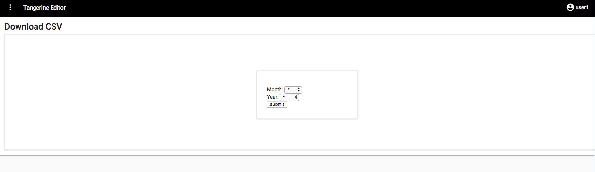
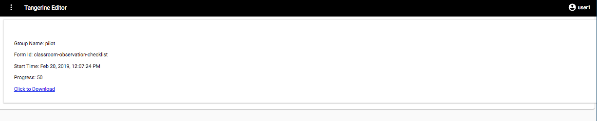

Download CSV 
============

As mentioned earlier, on the group's main page listing the
instruments/forms for the group, Tangerine provides a download CSV
function on the main Tangerine editor page.

Click the download icon

to see the interface below. From here,
you can select the results for a specific month or year of data
collection.

**NOTE**: To be able to download all the data select the \* on both
Month and Year and click the SUBMIT button.

If the CSV generation was successful, the following screen will present
the group name, Form id , Start time and progress of the CSV download.

Once the CSV has been created, you can find it in your Downloads folder.