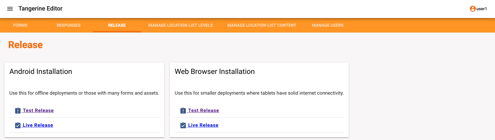
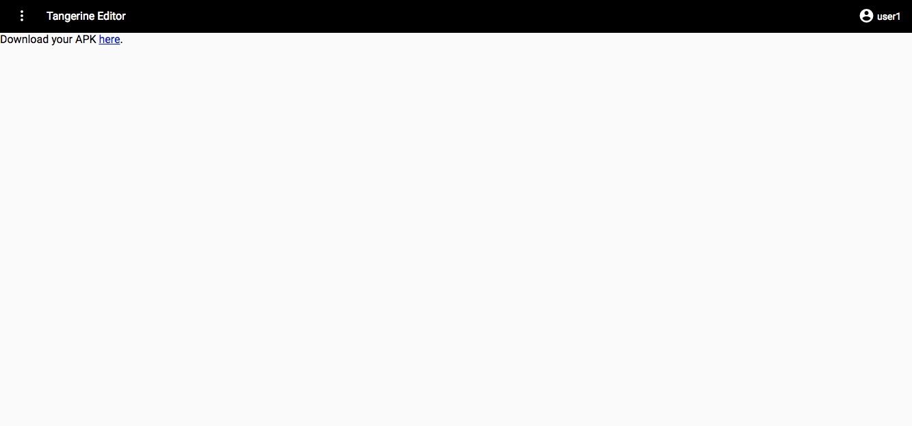
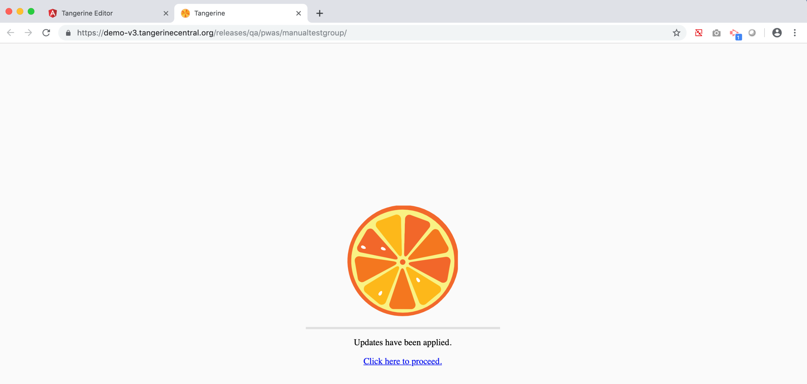
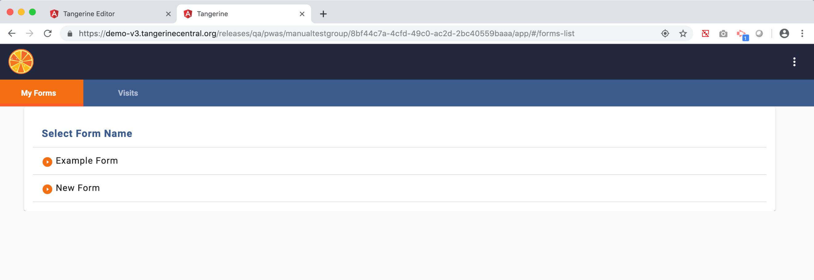

Deploying Tangerine for Offline (or Online) Data Collection 
===========================================================

Once the user is done creating the instruments/forms the next step is to
deploy the instrument to an Android device for data collection. To
release your instruments or instrument updates, select the "Release" tab
in the top menu of the main group page.

Upon selecting "Release", you will see the screen below.

Tangerine offers two deployment types, test release and live release:

1.  **Test Release** -- This release option ("release to QA") is
    recommended for testing the instruments. When you make changes and
    updates to the instruments and release your changes as "Test
    Release", tablets that have the "real" version of Tangerine
    installed will NOT receive this update. HOWEVER, any data synced
    from the tablet devices even in a "Test Release" deployment goes
    into the main database (thus mark your tests clearly as "TESTS" to
    facilitate data cleaning.

2.  **Live Release** -- When instruments/forms are final, or instrument
    edits have been tested, use this release option ("release to
    production"). In this case, tablets that are already collecting
    data, or have the group's apk installed, will received an update
    request when connecting to the Internet the next time. All data
    collected from this release will also be added to the main database.

Tangerine also offers two deployment /installation strategies, Android
installation or web browser installation:

-   **Android Installation**. This is the standard deployment package
    where an actual apk file can be generated on the computer,
    downloaded, and then copied over to a mobile device via a USB cable
    and installed. This method of deployment is suitable in slow network
    environment or when the apk is large.

-   **Web Browser Installation**. This deployment strategy requires an
    Internet connection on the tablet for the Tangerine to be installed.
    Once installed, the app can work again offline. This method is
    suitable in places of good connectivity.

**NOTE**: We recommend thoroughly testing your instruments and its data
output before releasing them!

Android Installation
--------------------

This deployment strategy creates an APK file which can be installed on
an Android tablet or smartphone. Click on Android Installation Test
Release/Live Release as shown in the screen above. **Wait.**

Once Tangerine has compiled the apk, click on "Download your APK here",
as shown below. This will download an apk file into your computer's
downloads folder.

**NOTE:** Every time an instrument/form is changed, added, or deleted
from the group, it is necessary to create a release and alert each
tablet user to use the "Check for Update" option in order to update
their application.

Web Browser Installation
------------------------

This deployment strategy creates a link/URL to a "progressive web app"
(PWA) for direct installation from the web to the Android tablet or
smartphone. Click on Web Browser Installation Test Release/Live Release.
**Wait.**

Once Tangerine has compiled the PWA, it will show an installation URL
like in the screen below.

Use this URL from the **Chrome browser on the tablet** to install the
PWA on the tablet devices.

You can also copy the URL and open a new browser tab with this URL on
your computer to test your instruments online. The browser window may
require you to confirm that you want to apply the updates.

After "**Click here to proceed**", Tangerine will show an online data
collection version of your instruments with a similar look and function
as on a tablet/smartphone.

**NOTE**: Every time an instrument/form is changed, added, or deleted
from the group, it is necessary to release the apk/pwa again, but **NO
NEW INSTALLATION is necessary** on the tablets. Instead, instruct
Tangerine tablet users to connect their tablets, select their profile
page (3 vertical white dots on top right of tablet screen).

Select "**Check for Update**" and proceed to install the update.

**NOTE:** This update approach will not only apply any instrument/form
edits, new forms, or form deletions, but also any **updates to the
Tangerine application** made in the meantime and applied to your group
(if any).