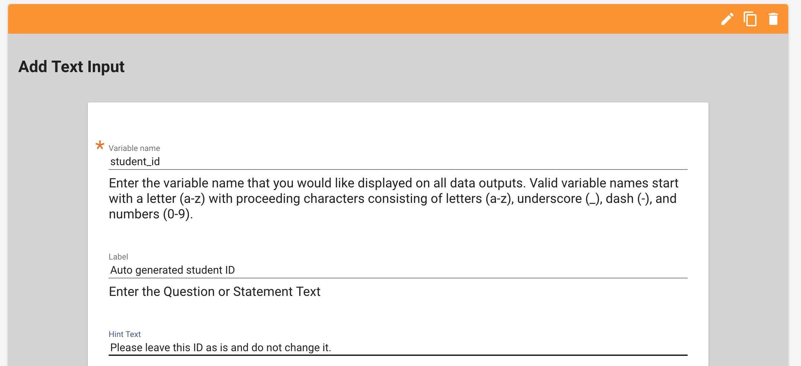
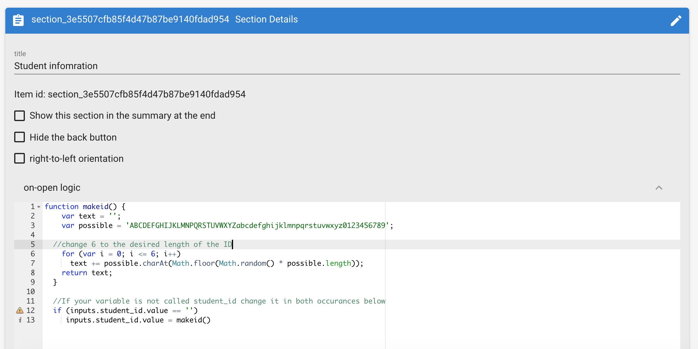
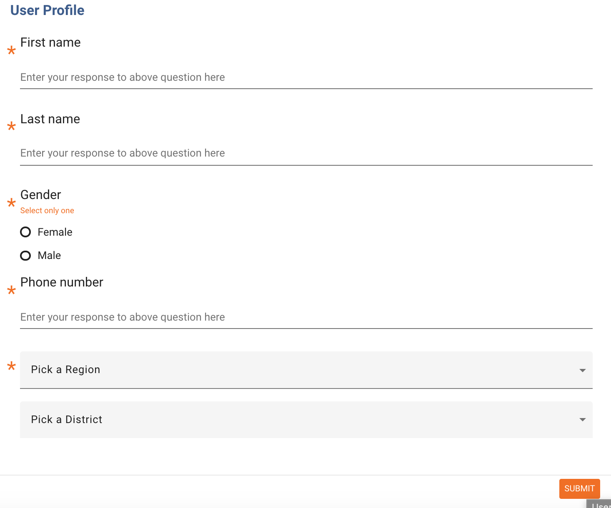
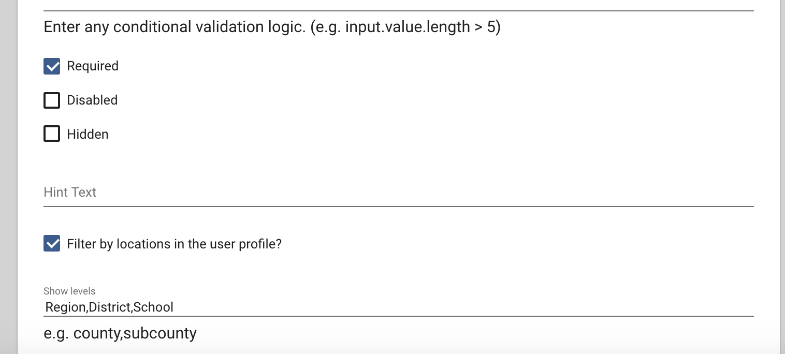
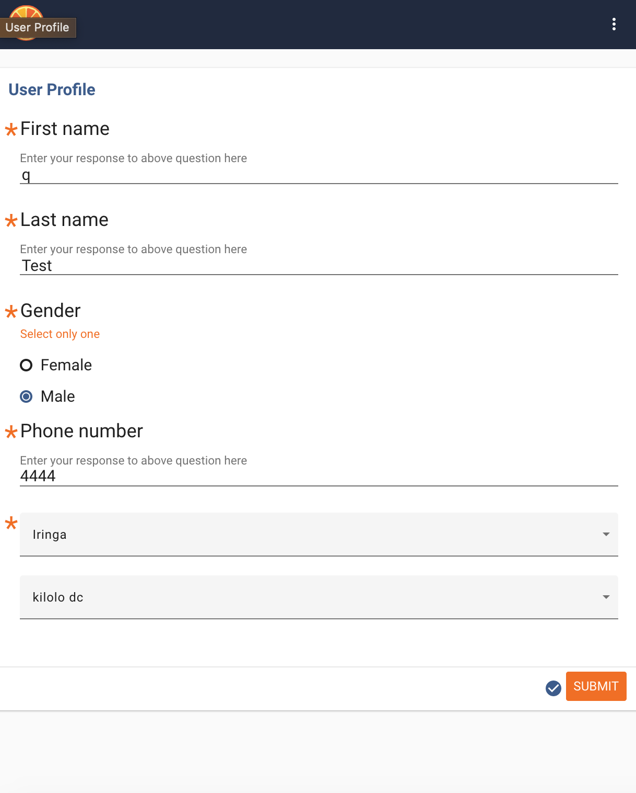
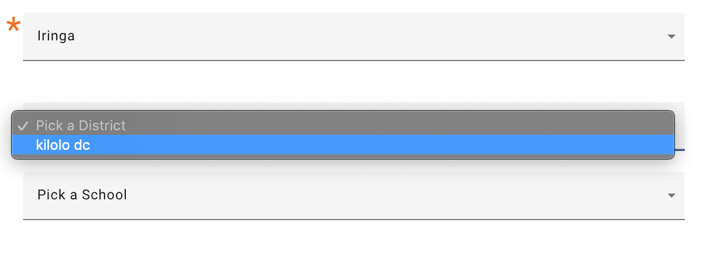
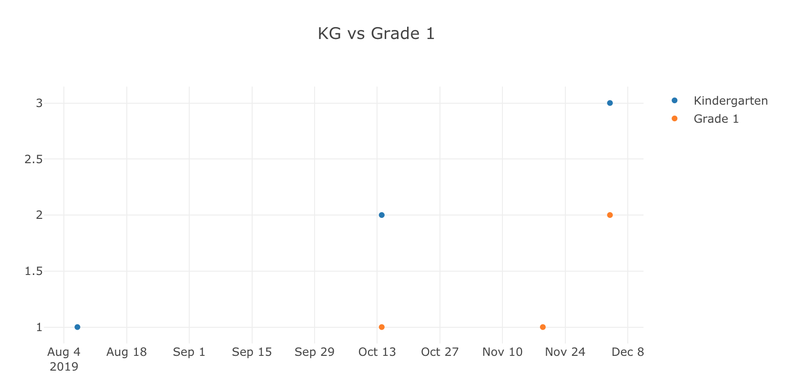

In this appendix we will show you how to do certain things that require
more technical knowledge or experience with Tangerine

Adding an auto-generated ID
---------------------------

An autogenerated student or teacher ID is something that you may need to
add to each one of your instruments. In the example here I will show you
how to add an ID field that is already populated upon opening the page.
Here are the steps to set this up:

1.  Create an input field of type TEXT and type in 'student\_id' as its
    name. Mark this field as required and click save.

2.  Copy and paste the code that I have before into the on-open section
    logic

Go the section where you'd like to add a student id. This new field
doesn't have to be in a separate section and can be part of the Student
Information page.

Click the Insert Here button, to add a new input, and select TEXT under
the first Inputs column.

On the next page under name type in *student\_id*

Add a label and any other information you'd like for this field and save
it.

Now click the Edit icon on the top left of the section header

Click the 'on-open' text link to edit it and paste the below code inside
the field:

> *function makeid() {*
>
> *var text = \'\';*
>
> *var possible =
> \'ABCDEFGHIJKLMNPQRSTUVWXYZabcdefghijklmnpqrstuvwxyz0123456789\';*
>
> *//change 6 to the desired length of the ID*
>
> *for (var i = 0; i \<= 6; i++)*
>
> *text += possible.charAt(Math.floor(Math.random() \*
> possible.length));*
>
> *return text;*
>
> *}*
>
> *//If your variable is not called student\_id change it in both
> occurances below*
>
> *if (inputs.student\_id.value == \'\')*
>
> *inputs.student\_id.value = makeid()*

You should see something like this on your screens

Click the Submit button to save the change. If you deploy this form now
you will see that upon opening this section the ID is generated and
already inserted into the student\_id variable.

You can use this file to help you generated the code that you need:
<http://bit.ly/2JBk2P3>

Changing the label of an input
------------------------------

In some situations, you may wish to change the label of an input as to
give different instruction or to add a variable name to it (like some
calculation or the result of a previous selection). You can easily do
this by following the below steps

1.  Add the question that you wish to change

2.  Add code and/or calculations to change the label in the on-open
    event of a section

Let's first add question with variable name Q\_10. Now, let's assume
that you want to change the label for this question based on some
calculation, and we want to add the result of the calculation to the
label. Go to the on-open event on the section containing Q\_10. Add the
below code and click Submit:

> var calc =
> getValue(\'teachers\_present\')/getValue(\'teachers\_enrolled\')
>
> inputs.Q\_10.label = \'The teacher ratio is\#\' + calc + \' Please
> keep this in mind when answering the below question.\'

What am I doing above? First I calculate some ration of teachers present
vs teacher enrolled, which I've collected on a previous form. Then I
make this ratio part of the label for questions Q\_10.

If you'd like to only assign a certain label without calculating
anything you can do this:

> inputs.Q\_10.label = \'Previously you responded that there are \#\' +
> getValue(\'teachers\_present\') + \' teachers present. How many of
> them were prepared for class?\'

Filter the location list based on the user profile's location
-------------------------------------------------------------

Let's assume that you have a location list with levels Region, District,
and School. Now let's also assume that on the user profile page, you
have added a location input with levels Region and District. You have
also asked each assessor to select their district on the user profile
page, after they have logged in.

Your user profile page looks like so:

Note above how the levels defined for this location input are Region and
District. On the actual assessment form your location levels include the
full hierarchy, for example, Region, District, and School. There is one
more option that I want to check here which is "Filter by locations in
the user profile" In the assessment form make sure that your data is
like the example below:

What will enabling the filter on the assessment form do? It will display
only the district that this user has selected under their user profile.
This makes the selection of a school much easier in a list with a lot of
regions and districts. Let's see how it works on the tablet.

When filling in my user profile I will select the 'Kilolo DC' district

Now every time start a form containing a location input in it, I will
only see the district that I selected on the user profile and no other
regions or districts will be given to me for selection. By doing this,
you ensure that the assessor will never select a school with the same
name form a different district or make a selection that doesn't
correspond to their actual location.

Note how in the above screenshot, there is only one district showing up.
Under the region selection we also see only the region that the Kilolo
DC district belongs to.

Appendix B
==========

In this appendix we will link some video tutorials and helper files that
you can use to have a live example on how to do certain things with
Tangerine

How to create new users and add them to a group
-----------------------------------------------

See how to create a user and add them to a group.

<https://youtu.be/_gYGC2_J2EU>

Importing a location list 
-------------------------

Make sure that the column names in your Excel exactly match the levels
define in Tangerine (Including any capital letters)

The part about importing metadata for your location is optional. You do
not have to define metadata if such is not used in your scenario

<https://youtu.be/RSJmNu7ef3U>

Location list sample file with IDs
----------------------------------

In this file you will find out a sample location list with the IDs
generated by Excel. You can use the formula for generating the Ids if
your file does not contain such.

<http://bit.ly/2WzcTnB>

Defining a meta data template to present to the user upon selection
-------------------------------------------------------------------

If you do decide to use metadata, you need the part below in order to
display some/all of it to the data assessor. If you are not displaying
this information to the tablet user it will still end up in your CSV
file.

<https://youtu.be/M83zFwtR-4A>

Adapt the line below to fit yoru metadata and level information so that
this is printed to the assessor

\${node.level === \'**LEVEL\_VARIABLE**\' ?\` EMIS:
\${node.**META\_DATA\_VARIABLE**}\`:\'\'}

Replace the bold text with your corresponding level and meta data
variable. Make sure you enable the metadata for the location input and
paste this code as content.

Add an 'Other, specify' field for a location list
-------------------------------------------------

In this video we show you how you can add an 'Other' field for a
location list. To help you generate the code we also use another helper
file for this.

<https://youtu.be/obTQusAKeRM>

The helper file to generate the necessary code is located at
<http://bit.ly/2DLy3Xa>

Generate an Autogenerated ID field
----------------------------------

This helper file will help you generated the code for your autogenerated
ID

<http://bit.ly/2JBk2P3>

Automatically fill in the date and time fields in a section with the current date
---------------------------------------------------------------------------------

This helper file will help you generate the code required to
automatically fill in the date and time fields located in the same
section with the current date and time on the tablet. Hint: to prevent
the user from changing these values you can mark the inputs as Disabled

<http://bit.ly/2PSJbZC>

Add a two variable tablet report 
--------------------------------

You can make use of the helper file located at <http://bit.ly/2Yi8PsF>
to generate the code for a two variable tablet report like in the image
below. This report shows you the count of occurrence of the two
variables per day

Refer to the instructional video at <https://youtu.be/ne5pZkWvjKY>

