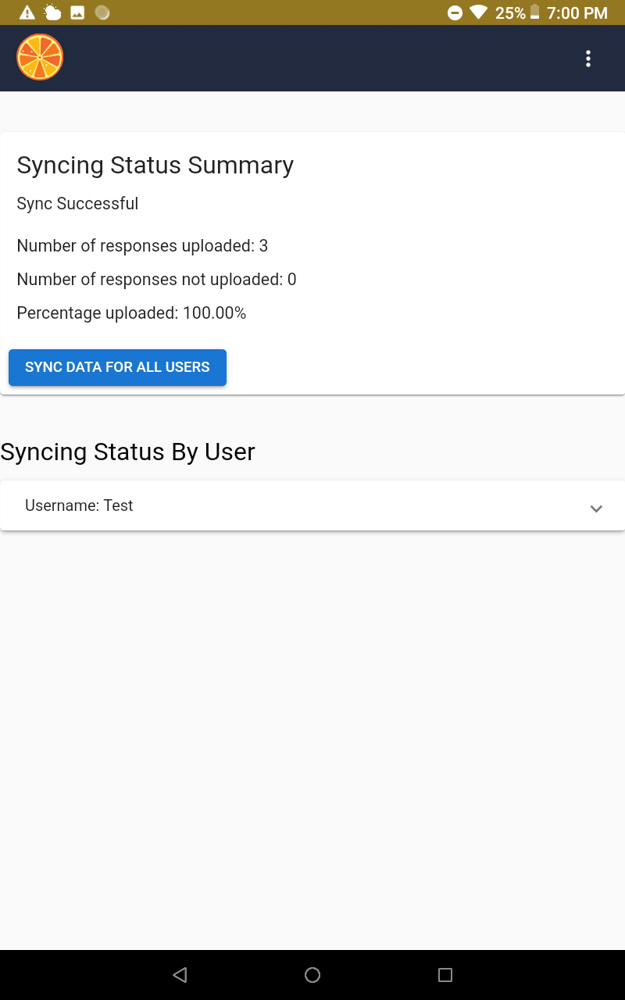

Using Tangerine on the Mobile Device
========================================

When using "Android Installation", install the
Tangerine apk upon moving it onto the tablet device. Make sure you have
selected "**Unknown sources**" under **Settings \> Security** to allow
installation of apps from sources other than the Play Store.

When using the "Web Browser Installation" strategy, enter the PWA URL
generated above into the URL field of the Chrome browser. Upon start of
the download process, you will be prompted about "**Adding Tangerine to
Home screen**". Confirm this with "ADD" on the next prompt.

Close your browser and open Tangerine from your device's home screen or
app drawer. Do not use the browser link anymore.

Registration and Log in
-----------------------

Have users register on the tablet. This is only required once for each
user on a given tablet.

Log in following registration.

You should now see the main Tangerine screen with your group's
instrument listed on the tablet.

**NOTE**: Hitting the tangerine icon in the top left corner will return
the user to Tangerine's home screen.

Administrating Instruments
--------------------------

Select the instrument to use, and follow the prompts, sections, and
items on the screen, as generated in the instrument/form editor. To
select an answer option, just tab on it.

**NOTE**: Different to all other inputs, where the user/assessor selects
the applicable / correct response which will then be marked in blue, in
grids, the user has to select all **INCORRECT** items (they will turn
blue).

Resuming Instrument
-------------------

Should an administration be interrupted, or to be completed at a later
stage, navigate to "**Visits**" on the top of the tablet screen.

**NOTE**: You have to have a location section and location list loaded
for your instrument to be able to access the resume feature in
Tangerine. Make up a location list, even if it only has one column
header entry and one item underneath (e.g. column A header is "site",
row 2 entry is "test site". Without a location list loaded, you will not
have a "Visits" tab on the tablet from which to resume the instrument.

Select the appropriate location and date (as applicable) from the menu.
Tangerine will automatically return the user to the last, incomplete
section/page of the instrument.

You can return from the "Visits" page to the main screen by hitting the
Tangerine icon.

Syncing Data
----------------------------------------------------------------------------------------------

Whenever possible during data collection, recommend that users /
assessors to sync their data to the tablet by navigating to the profile
menu, and select "**Sync**".

The Sync screen provides an overview of the data upload/sync status to
date, including the number of responses not yet uploaded as shown below.

Once the sync is complete, Tangerine will show "**100%**" for the field
"**Percentage uploaded**".

