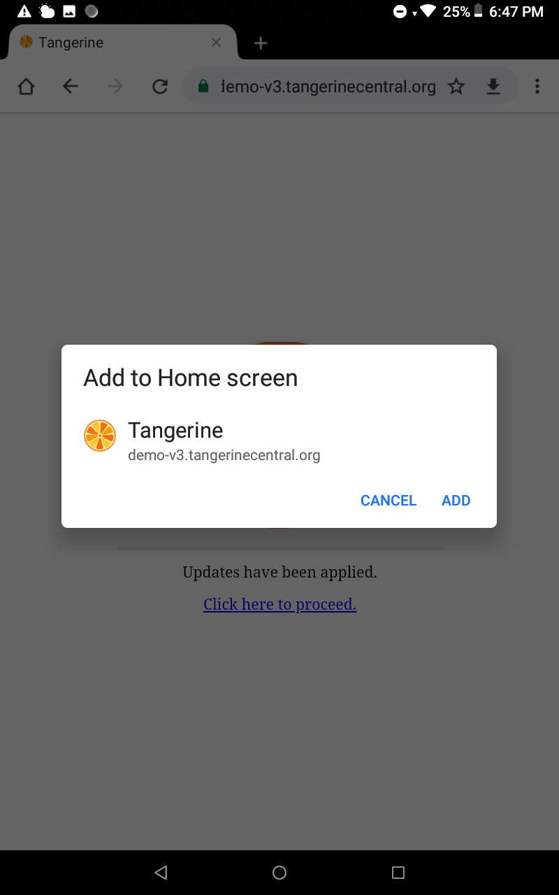
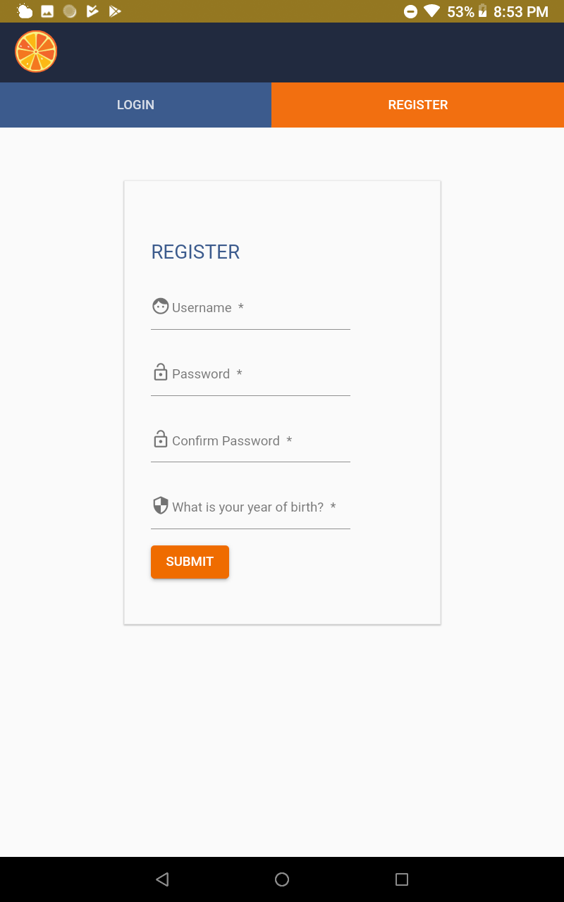
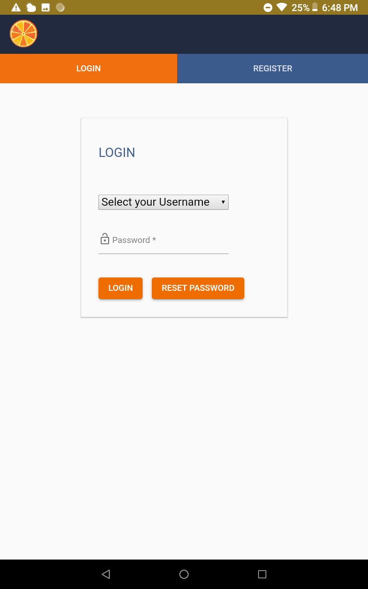

Using Tangerine on the Mobile Device
========================================

When using "Android Installation", install the
Tangerine apk upon moving it onto the tablet device. Make sure you have
selected "**Unknown sources**" under **Settings \> Security** to allow
installation of apps from sources other than the Play Store.

When using the "Web Browser Installation" strategy, enter the PWA URL
generated above into the URL field of the Chrome browser. Upon start of
the download process, you will be prompted about "**Adding Tangerine to
Home screen**". Confirm this with "ADD" on the next prompt.

Close your browser and open Tangerine from your device's home screen or
app drawer. Do not use the browser link anymore.

Registration and Log in
-----------------------

Have users register on the tablet. This is only required once for each
user on a given tablet.

Log in following registration.

You should now see the main Tangerine screen with your group's
instrument listed on the tablet.

**NOTE**: Hitting the tangerine icon in the top left corner will return
the user to Tangerine's home screen.

