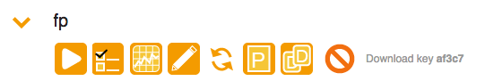
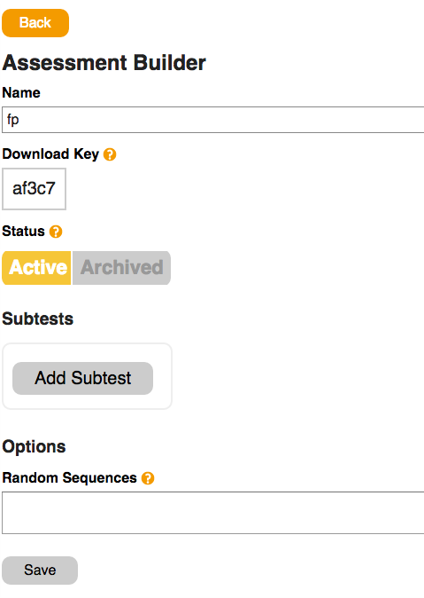
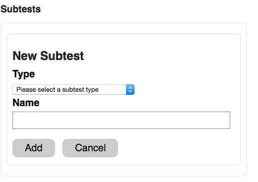
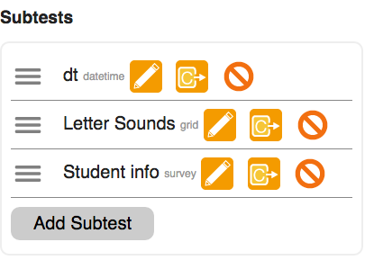
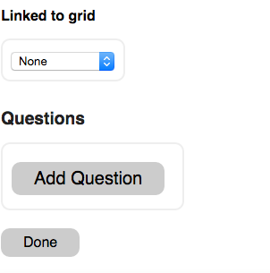
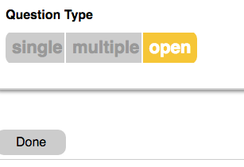
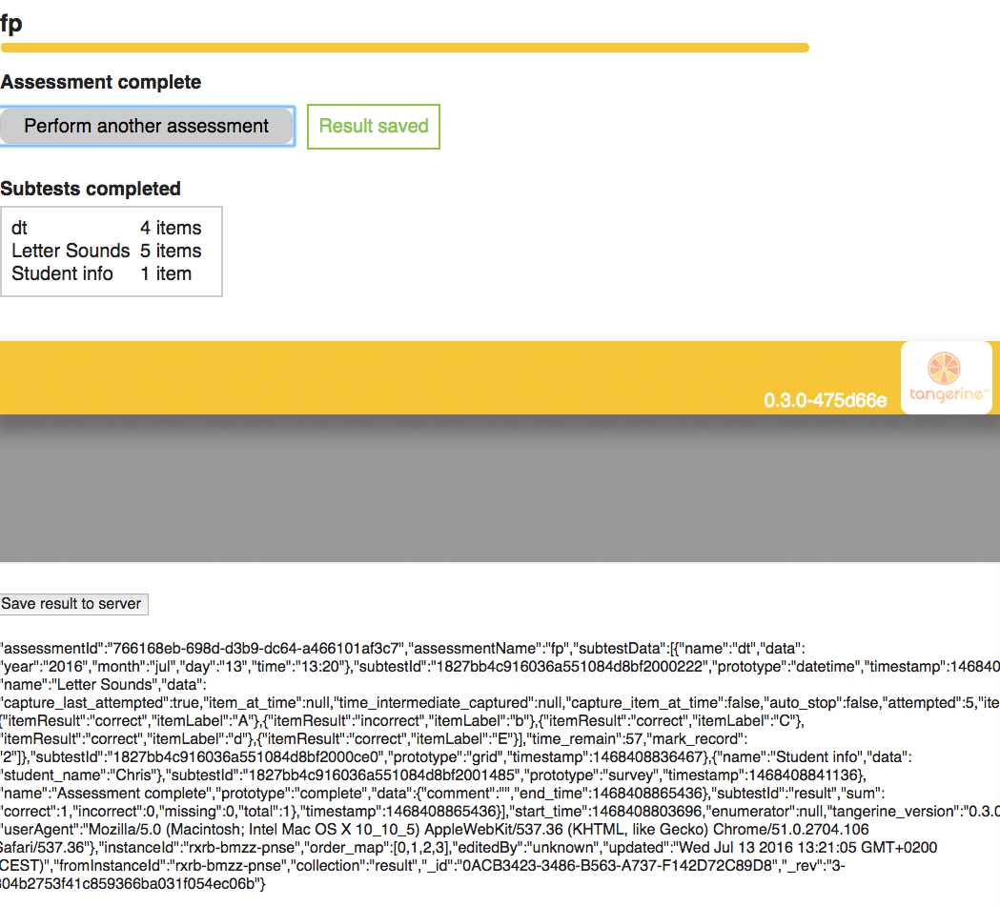
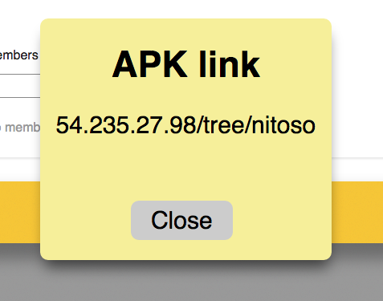
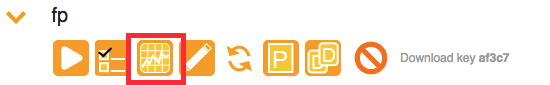

# Installation and Testing on AWS

The instructions in the Tangerine Readme recommend installing Tangerine on a Digital Ocean instance. This document provides instructions 
for installing on Amazon AWS and additionally provides instructions for testing Tangerine. 

These instruction require some knowledge of AWS and Linux.

## Creating the AWS instance

Login to AWS and Launch a new instance with Ubuntu 14.04 using a t2.medium server with 4 GiB memory. 

Volume should be larger than the 8GB default. 24GB would be useful.

### Server details
Ubuntu Server 14.04 LTS (HVM), SSD Volume Type - ami-fce3c696 <br/>
Ubuntu Server 14.04 LTS (HVM), EBS General Purpose (SSD) Volume Type.<br/>
Root Device Type: ebs Virtualization type: hvm

### AWS Instance details

<table>
<tr>
<th>Instance Type</th><th>ECUs</th><th>vCPUs</th><th>Memory (GiB)</th><th>Instance Storage (GB)</th>
</tr>
<tr>
<td>t2.medium</td><td>Variable</td><td>2</td><td>4</td><td>EBS only</td>
</tr>
</table>


Storage : default (8 GiB)

### Security
Security group: 

- HTTP: TCP	80	0.0.0.0/0
- SSH	TCP	22	0.0.0.0/0

## Login
Once your server is created, login with your key:
```` 
 ssh -i ~/.ssh/iyour_key -l ubuntu ec2-54-999-99-99.compute-1.amazonaws.com
````
## Installing Docker
Follow the instructions here: https://docs.docker.com/engine/installation/linux/ubuntulinux/
 
Commands I used in following those instructions:


    sudo apt-get update
    sudo apt-get install apt-transport-https ca-certificates
    sudo apt-key adv --keyserver hkp://p80.pool.sks-keyservers.net:80 --recv-keys 58118E89F3A912897C070ADBF76221572C52609D
    sudo vi /etc/apt/sources.list.d/docker.list
    (creates a new file)
    enter the following:
    deb https://apt.dockerproject.org/repo ubuntu-trusty main
    sudo apt-get update
    sudo apt-get purge lxc-docker
    apt-cache policy docker-engine


That last command verifies you are pulling from the correct repo

Install dependencies for docker


    sudo apt-get update
    sudo apt-get install linux-image-extra-$(uname -r)
    sudo apt-get install apparmor


Now install docker


    sudo apt-get update
    sudo apt-get install docker-engine
    sudo service docker start
    
    (docker will already be running)


Verify that all is installed correctly:

    sudo docker run hello-world

Now you are ready to install Tangerine.

Go to the [Tangerine Releases page](https://github.com/Tangerine-Community/Tangerine/releases) and copy the .tar.gz file 
of the latest release

    wget https://github.com/Tangerine-Community/Tangerine/archive/0.3.0.tar.gz
    tar xvf 0.3.0.tar.gz
    cd Tangerine-0.3.0
    cp config.defaults.sh config.sh
    nano config.sh
    Change T_HOST_NAME to your instance's IP address
    Change T_USER1_PASSWORD and T_PASS to password of your choice.
    Control O and control X to save and exit.

Login as sudo:

    sudo -i
    cd /home/ubuntu/Tangerine-0.3.0
    enter:
    ./install.sh

This will download and extract the docker image from Tangerine on docker hub.

## View Tangerine in browser

You should now be able to view Tangerine in your web browser by pasting the ip address of your instance.

## Testing Tangerine

Login using the users1 user to login

### Create a New Group

Click Groups and then Accounts to create your first Group.<br/>
Enter a name - such as test1 - and click Join group. <br/>
The application will confirm that the new group has been created.<br/>
Click the Back button (the app's, not the browser's) and you will see a list of Groups. Click your new group.

### Create a New Assessment

Now you may create a new Assessment by clicking "New" under the Assessments section and entering a name for the new Assessment.
The new Assessment wiill be displayed in the listing. Click the widget to the left of your new Assessment name to reveal the options.



Click the fourth option to edit the Assessment.

### Adding Subtests

Add Subtests in the Subtests section of the Assessment Builder:



In the following examples, we will create a widget to capture the current data and time and two common subtests.

#### Create Date and Time Widget

Click Add Subtest to display the "New Subtest" page:



Choose Date and Time and enter a name and click Add

#### Create Grid subtest

Click Add Subtest.<br/>
Choose Letter Sound Knowledge in the Grid section, enter a name, and click Add.

#### Create Survey Subtest

Click Add Subtest.<br/>
Choose Student Survey in the Survey section, enter a name, and click Add.<br/>

Now you have a list of the 3 main parts of the Assessment. 



But we're not done yet! 

In the Student info subtest, click the Edit button (pencil icon) and scroll to the Questions section at the bottom of the page.<br/>

##### Add Question to Survey



Click Add Question.<br/>
Enter a prompt and variable name ("What is your name?", "student_name") and click Add<br/>
Click Done.<br/>
It will save your assessment and display an error message that the question has no options. <br/>
In the Student info subtest, click the Edit button (pencil icon) and scroll to the Questions section at the bottom of the page.<br/>
Click the Edit button (pencil icon) for the Question and choose Open.



Click Done.<br/>
Click Done.<br/>
Click Back.<br/>

### Run the Assessment
Now you may run your assessment. Expand the options widget for your Assessment and click the first icon to run it.
This runs the Assessment in the Tangerine client widget, which is the same code that will be used in the Android APK.

Complete the Assessment and click Save Result.

It will display the JSON for the result at the bottom of the page. If you wish to save your result to the CouchDB, click "Save result to server."



### Generate an APK

To generate an APK, click APK. The first time it runs, it will take a few minutes to process. 

Once it is create, Tangerine will display the url for the created APK. 



Download it and install :

    adb install ~/Downloads/tangerine.apk
    
Once it has installed, launch the Tangerine app.

### Testing an APK

Click the sign up tab.<br/>
Enter a username/password. Any name will suffice.<br/>
Complete assessment.

To upload data to the server, on the home screen click "Universal Upload." It will confirm if the data has been upload successfully.

### Viewing data entered into Tangerine

Return to your browser instance of Tangerine. Click Results. View your data.

Go back to Home and click the widget to expand the options for your Assessment. Click the third icon for results.



### Downloading Tangerine data

Click the CSV button. This will download a spreadsheet with the results.
 
