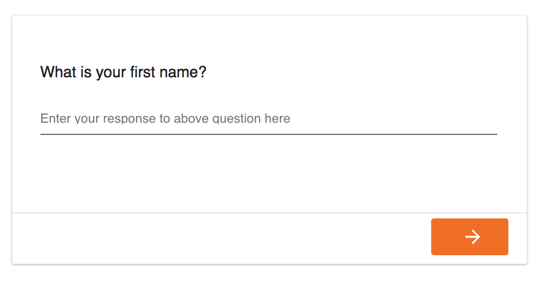
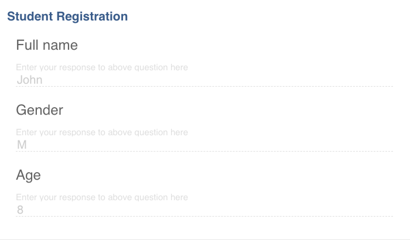

# \<tangy-form\>

[](https://www.webcomponents.org/element/tangy-form) [](https://greenkeeper.io/) [](https://travis-ci.org/Tangerine-Community/tangy-form)

An element for multipage forms.

- Conforms to Material Design guidelines.
- Loads of handy input elements such as `<tangy-gps>`.
- Easy to write logic for the form for hiding / showing and disabling / enabled inputs.

Try out the [demos on Glitch](https://tangy-form-demo.glitch.me/) or get started creating your own Tangy Form on [CodePen](https://codepen.io/rjsteinert/pen/RXxwmP) or [Glitch](https://glitch.com/edit/#!/remix/tangy-form-example-template).

[](https://codepen.io/rjsteinert/pen/RXxwmP)


<!--
```
<custom-element-demo>
  <template>
    <script type="module" src="tangy-form.js"></script>
    <next-code-block></next-code-block>
  </template>
</custom-element-demo>
```
-->
```html
<tangy-form id="my-form">
  <tangy-form-item id="item1">
    <tangy-input name="input1" label="What is your first name?"></tangy-input>
  </tangy-form-item>
  <tangy-form-item id="item2">
    <tangy-input name="input2" label="What is your last name?"></tangy-input>
  </tangy-form-item>
</tangy-form>

<script>
  document.querySelector('#my-form').addEventListener('submit', event => {
    // By default, the form response is locked and the user can browse it. Use event.preventDefault() 
    // to do something else.
    event.preventDefault()
    // 3 ways to inspect the user's response to the form. Ordered by level of detail.
    console.log(event.target.response)
    console.log(event.target.inputs)
    console.log(event.target.values)
  })
</script>
```

Tangy-form also has some convenience methods to disable inputs and item buttons - an easy way to display form results:
- enableItemReadOnly() - disables the inputs in the form
- hideItemButtons() - hides the Open/Close buttons



You can re-enable the form by using disableItemReadOnly() (and showItemButtons(), if necessary).

## Installation
`<tangy-form>` is a Custom Element built with Polymer and can be used in frameworks such as Angular, React, and Vue. Check compatibility with your project's framework on [Custom Elements Everywhere](https://custom-elements-everywhere.com/).  If you are ready to go, run `npm install --save tangy-form` to add it to your project. Depending on your build system/framework, there may be different steps to take to get Web Components loading.

### Install using the CDN
A quick and easy way to get started with Tangy Form in your app is to add the necessary script tags to import dependencies from CDNs. The following should be all you need to get started.

```
  <script src="https://cdnjs.cloudflare.com/ajax/libs/webcomponentsjs/2.2.10/webcomponents-loader.js"></script>
  <script src="https://cdnjs.cloudflare.com/ajax/libs/redux/4.0.4/redux.js"></script>
  <script src="https://unpkg.com/tangy-form@3.21.0/dist/bundle.js" type="module"></script>
```


### Install in a Polymer v3 project
```
npm install --save tangy-form
```
Because Redux is not playing nicely with bundlers, you need to include it as a global dependency in [a script tag](https://redux.js.org/#installation) as you will see in the `demo/index.html`.

Then from any of your elements, import tangy-form.
```
import 'tangy-form/tangy-form.js'
```

### Install in an Angular v4+ project
Run on the command line...
```
npm install --save tangy-form redux @webcomponents/webcomponentsjs
```

Then add to your `./polyfills.ts` file...
```
import * as Redux from 'redux';
(window as any).Redux = Redux;
import '@webcomponents/webcomponentsjs/webcomponents-sd-ce.js';
import 'tangy-form/tangy-form.js'
```

Lastly, any module where you are going to use a Web Component you need to let Angular know it can be flexible with the names of components by import `CUSTOM_ELEMENTS_SCHEMA`. Note that just enabling on the app module level is not enough for children modules to also use flexible schema. You need to do the same for those children modules as well.

```javascript
import { NgModule, CUSTOM_ELEMENTS_SCHEMA } from '@angular/core';
...
@NgModule({
  declarations: [
    AppComponent
  ],
  schemas: [ CUSTOM_ELEMENTS_SCHEMA ],
...

```

### Install Tangy Input elements
Due to the growing number of Tangy input elements, you'll need to specify which Tangy input elements to include in your application with additional import statements. See the `input` folder for a list of elements and import them using...

```javascript
import 'tangy-form/input/tangy-input.js'
import 'tangy-form/input/tangy-radio-buttons.js'
import 'tangy-form/input/tangy-checkboxes.js'
```

### Theming
You can provide some CSS overrides by providing a custom style definition in your app's `index.html`.

```html
<custom-style>
  <style>
    html {
      --document-background-color: #FAFAFA;
      --primary-color-dark: #3c5b8d;
      --primary-text-color: var(--light-theme-text-color);
      --primary-color: #3c5b8d;
      --accent-color: #f26f10;
      --accent-text-color: #FFF;
      --error-color: var(--paper-red-500);
      --warn-color: #993f0b;
      --warn-background-color: #f4e688;
      --disabled-color: #BBB;
    }
    h1, h2, h3, h4, h5 {
      @apply --paper-font-common-base;
      color: var(--primary-text-color);
      margin: 25px 0px 5px 15px;
    }
  </style>
</custom-style>
```

### Logic

The tangy-if and valid-if properties can be added to inputs to provide conditional logic to a form. 
Here is an example for a tangy-form-item reveals a tangy-box if the user does not input the desired selection in a tabgy-checkboxes input:

```
<tangy-form-item id="item1">
<tangy-checkboxes name="input1" label="What is your favorite fruit?" valid-if="getValue('input1')[0] === 'Tangerine'">
  <option name="orange">Orange</option>
  <option name="banana">Banana</option>
  <option name="tangerine">Tangerine</option>
  <option name="cantalope">Cantalope</option>
  <option name="cherry">Cherry</option>
  <option name="kiwi">Kiwi</option>
</tangy-checkboxes>
<tangy-box tangy-if="inputs.input1.invalid === true">
  You really should consider liking tangerines.
</tangy-box>
</tangy-form-item>
```

See tests/tangy-form-item_test.html for examples for other inputs.

The exposeHelperFunctions function in tangy-form-item.js exposes helper functions that may be used in tangy-if and valid-if statements. 
The most commonly used function is getValue(name). It checks the value of a named input first in the DOM and then (if not found in the DOM) in the redux store.

## Run the demo
Requires node.js and npm installed.
```sh
git clone https://github.com/tangerine-community/tangy-form
cd tangy-form
npm install
npm start
```
Then open http://localhost:8080

## Tests 
One of the best places to learn about what Tangy Form is capable of is to take a look at the tests in `test/tangy-form_test.html`. To run tests, use `polymer test` command or just `npm run test` to just run tests in Chrome. If you want to develop tests, open http://localhost:8080/test/tangy-form_test.html

Note you will need Java 8 installed in order to run tests. Info on installing Java 8 or uninstalling Java X to install Java 8 can be found [here](https://github.com/Polymer/tools/issues/405#issuecomment-405096764). 

If running on a Mac with the M1 processor, you must run `node node_modules/polymer-cli/node_modules/wd/scripts/build-browser-scripts.js` 
in order to avoid the error `cli runtime exception: Error: Cannot find module '../build/safe-execute'`
